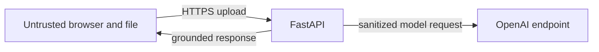

# Paperplane threat model

## Scope

The active system is a Next.js browser UI, a stateless FastAPI service, PyMuPDF document
processing, and outbound OpenAI model calls. It does not retain uploads or responses.

## Trust boundaries

## Assets

- OpenAI and optional Paperplane API keys
- Source-document contents and rendered page images while a request is active
- Extracted Markdown, JSON, coordinates, and usage metadata
- Service availability and model spending quota

## Principal threats and controls

| Threat | Controls |
|---|---|
| Malicious or oversized document | File signatures, extension/type checks, byte/page/pixel limits, bounded parsing |
| Prompt injection inside a document | Treat document text as data, strict structured outputs, bounded prompts, no tool execution from content |
| Credential disclosure | Backend-only environment variables, sanitized errors, no credential or header logging |
| Cross-origin abuse | Exact CORS origins, optional `X-API-Key`, credentials/wildcard startup guard |
| Resource and cost exhaustion | Upload limits, page limits, rate limiting, bounded verification budgets, upstream timeouts |
| Path traversal | Uploaded filenames are reduced to a basename and are not used for persistent writes |
| Sensitive-data retention | No application persistence; callers control saving responses |
| Upstream compromise or interception | HTTPS endpoint, restricted base URL configuration, safe error handling |

## Operational assumptions

The default loopback bind is not an internet security boundary. Public deployments require
TLS, a strong `API_KEY`, restricted CORS, infrastructure rate limits, monitoring, and an
appropriate privacy agreement with the model provider. Memory and temporary resources may
still be visible to the host operating system while a request is running.
