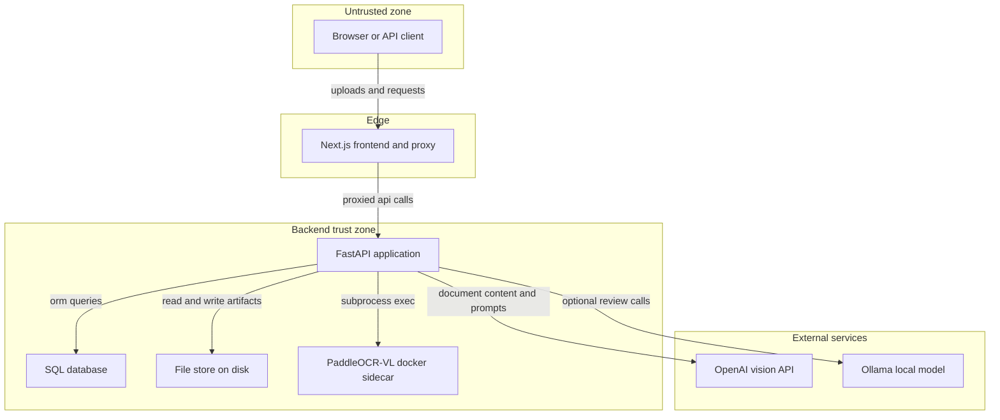

# Agentic Document Extraction — Threat Model

## Executive summary

This is a self-hostable document-extraction service (FastAPI backend + Next.js frontend) that accepts uploaded PDFs/images, parses them with a native library (PyMuPDF), and sends page content to OpenAI's Luna/Terra vision models (plus optional local Ollama and PaddleOCR-VL sidecars) to produce grounded Markdown and structured extractions. The dominant risk theme is **inconsistent authorization enforcement**: the app has a working, opt-in shared-secret auth mechanism (`require_api_key`) applied to nearly every router, but one router (`extraction_schemas.py`, full CRUD on extraction schemas) is mounted with no auth dependency at all — a concrete authorization bypass whenever `API_KEY` is configured. The secondary theme is that auth is disabled by default and the deployment docs explicitly describe an internet-exposed reverse-proxy topology, so "forgot to set `API_KEY`" is a realistic, high-impact operator error, not a theoretical one. A third, lower-severity theme is the untrusted-input surface inherent to the product itself: uploaded files reach a native PDF parser and are then embedded in LLM prompts, both classes of input the system must treat as adversarial.

## Scope and assumptions

**In scope:** `backend/app/` (FastAPI application, routers, services, auth, config, storage), `frontend/` (Next.js proxy and UI), deployment docs (`docs/DEPLOYMENT.md`, `docs/ARCHITECTURE.md`).

**Out of scope:** CI workflows, test suites, the `deploy/paddleocr-vl/` container image build itself (only its invocation from the backend is in scope), and the many duplicated agent-skill/config files in the repo root (`.claude/`, `.gemini/`, `.codebuddy/`, etc. — tooling metadata, not runtime).

**Assumptions confirmed with the user:**
- Both the default local/single-operator deployment and the documented internet-exposed reverse-proxy deployment (`docs/DEPLOYMENT.md`) are in scope, weighted toward the exposed case — "no `API_KEY` set" is treated as a realistic, high-impact scenario, not an edge case.
- Document sensitivity is **unknown / depends on the deployer** — storage/retention findings are ranked conditionally and should be re-assessed once the deployer's actual data classification is known.

**Open questions that would change the ranking:**
- Does any real deployment run multiple routers/processes behind a shared reverse proxy without `API_KEY`, or is that purely a documentation gap?
- Is there a log/artifact retention or deletion process operationally, even if not enforced in code?
- Are the optional Ollama and PaddleOCR-VL sidecars ever exposed to a different trust zone than the FastAPI backend (e.g., a shared Docker network with other tenants), or always co-located?

## System model

### Primary components
- **FastAPI backend** (`backend/app/main.py`) — routers for agentic parse/extract (`dpt_api.py`), legacy V2 jobs (`v2_jobs.py`, currently unmounted), extraction schemas, review cases, curation, evaluation runs, parse batches, reprocessing, runtime capabilities, Ollama model listing.
- **Auth layer** (`backend/app/auth.py`) — optional shared-secret (`X-API-Key` or `Authorization: Bearer`), constant-time compare, disabled when `API_KEY` is empty (the default).
- **Security headers middleware** (`backend/app/security_middleware.py`) + CORS middleware, origin allowlist from `CORS_ORIGINS` (defaults to localhost).
- **Persistence** — SQLAlchemy async ORM over SQLite by default (`DATABASE_URL` configurable to Postgres); `FileStore` (`backend/app/services/parsing/storage.py`) for on-disk artifacts, with a path-traversal guard (`Path.resolve()` + `relative_to()` check).
- **Document ingest** (`backend/app/services/parsing/ingest.py`) — PyMuPDF (`fitz`) parses uploaded PDF bytes directly; images handled via Pillow.
- **LLM integrations** — OpenAI Vision API (Luna/Terra models, primary path), optional local Ollama, optional PaddleOCR-VL via a Docker sidecar launched with `asyncio.create_subprocess_exec` (argv-list, not shell — no shell injection even though names are string-interpolated).
- **Frontend** (`frontend/`) — Next.js app; `next.config.js` proxies `/api/*` to `PAPERPLANE_BACKEND_ORIGIN`.

### Data flows and trust boundaries

- Internet / API client → Next.js frontend: HTTPS, no authentication at this hop; only `/api/*` paths are proxied.
- Next.js frontend → FastAPI backend: HTTP (typically localhost or private network per `docs/DEPLOYMENT.md`), authenticated only if `API_KEY` is configured; validated per-router via `Depends(require_api_key)` — **except `extraction_schemas.py`, which has no such dependency**.
- FastAPI backend → SQL database: SQLAlchemy ORM, parameterized queries (`select().where()`), same trust zone, no additional auth.
- FastAPI backend → FileStore (local disk): path is resolved and bounds-checked against the configured root before every read/write.
- FastAPI backend → OpenAI API: HTTPS, API key from environment (operator-controlled, not attacker-reachable); request bodies include uploaded-document images/text, i.e., attacker-influenced content is sent to a third party.
- FastAPI backend → PaddleOCR-VL Docker sidecar: local subprocess invocation, argv-list exec, container named from a server-generated job UUID (not attacker input).
- FastAPI backend → Ollama: HTTP to `OLLAMA_BASE_URL` (operator-controlled config), used for optional local review scoring.

#### Diagram

## Assets and security objectives

| Asset | Why it matters | Security objective |
|---|---|---|
| Uploaded source documents (PDF/image) | May contain PII, financial, or legal content depending on deployer (unconfirmed) | Confidentiality, Integrity |
| Extraction schemas (CRUD via `extraction_schemas.py`) | Define what data future extractions pull from documents; unauthenticated write access lets anyone redefine what's extracted org-wide | Integrity, Availability |
| Generated artifacts (Markdown, JSON extractions, annotated PDFs) | Derived from potentially sensitive source documents; persisted indefinitely with no observed retention policy | Confidentiality |
| `API_KEY` shared secret | Sole authentication mechanism for the whole app when configured | Confidentiality, Integrity |
| OpenAI API budget / account | Every parse/extract call is billed; unauthenticated access is unauthenticated spend | Availability (financial) |
| SQL database (job/task/review state) | Tracks all job lifecycle and review-decision state | Integrity, Availability |

## Attacker model

### Capabilities
- Can reach the FastAPI backend's HTTP surface directly if it's deployed behind a reverse proxy without additional network restriction (per `docs/DEPLOYMENT.md`'s documented topology).
- Can upload arbitrary PDF/image bytes as an ordinary API client — this is the product's intended function, so the attacker's uploaded file must be treated as fully adversarial input to PyMuPDF and to the LLM prompt.
- Can embed text in a document intended to manipulate the extraction agents (prompt injection) — the system's own prompts already instruct the models to ignore in-document instructions, indicating the developers are aware of this class.
- Cannot read environment variables, modify `API_KEY`, or otherwise tamper with operator-controlled configuration (trusted per deployment model).

### Non-capabilities
- Cannot perform SQL injection — no evidence of raw/string-built SQL; all observed queries use SQLAlchemy's parameterized `select()`/`where()`.
- Cannot escape `FileStore`'s configured root — path resolution is bounds-checked (`resolve()` + `relative_to()`) before every read/write/delete.
- Cannot achieve shell/argument injection into the PaddleOCR-VL Docker invocation — subprocess is invoked via argv-list `create_subprocess_exec` (no shell), and the interpolated identifier (`job_id`) is server-generated (`uuid.uuid4().hex`), not attacker-supplied.
- Cannot forge or bypass the `X-API-Key`/Bearer check via timing attack — comparison uses `secrets.compare_digest`.

## Entry points and attack surfaces

| Surface | How reached | Trust boundary | Notes | Evidence |
|---|---|---|---|---|
| `POST/GET /v2/*` (parse, extract, jobs) | HTTP via Next.js proxy or direct | Internet → Backend | Requires `API_KEY` when configured | `backend/app/routers/dpt_api.py:58` |
| `/api/extraction-schemas/*` (CRUD) | HTTP via Next.js proxy or direct | Internet → Backend | **No auth dependency at all** — reachable even when `API_KEY` is set | `backend/app/routers/extraction_schemas.py:23` |
| `/api/parse-jobs`, `/api/curation`, `/api/review-cases`, `/api/evaluation-runs`, `/api/parse-batches`, `/api/reprocessing`, `/api/runtime`, `/api/ollama` | HTTP | Internet → Backend | All correctly gated with `Depends(require_api_key)` | `backend/app/routers/*.py` (grep confirmed) |
| `/api/v2/jobs/*` (legacy) | HTTP, but router not mounted in `main.py` | N/A currently | Dead code in the running app; not a live entry point today, but still present and tested in isolation | `backend/app/main.py` (only `dpt_api_router` is included) |
| File upload → PyMuPDF parse | Any `multipart/form-data` upload to a parse endpoint | Internet → native library | Attacker-controlled bytes parsed by a native C library (MuPDF); size/page-count bounded (`max_upload_size_mb`, `max_document_pages`) but content itself unvalidated beyond that | `backend/app/services/parsing/ingest.py:47` |
| Document content → OpenAI/Ollama prompt | Any parse/extract call | Backend → third party | Attacker-influenced text/image reaches an LLM prompt; system prompts instruct the model to ignore embedded instructions (soft mitigation only) | `backend/app/services/parsing/v2_pipeline.py` (draft/reconciliation prompts) |
| `/health`, `/health/ready`, `/info` | HTTP, unauthenticated by design | Internet → Backend | Exposes model names and config booleans only; no secrets observed | `backend/app/main.py:68-111` |

## Top abuse paths

1. **Unauthenticated schema tampering** — Attacker discovers or guesses the backend URL of a deployment that has `API_KEY` set → sends `POST /api/extraction-schemas` (no credential required) → creates/overwrites extraction schema definitions used by other users' extraction jobs → impacts integrity of every future extraction relying on that schema, with no audit trail distinguishing the attacker's writes from legitimate ones.
2. **Unauthenticated cost-abuse** — Operator deploys behind the documented reverse proxy without setting `API_KEY` (the default) → attacker submits a stream of documents to `/v2/parse` → each call bills the operator's OpenAI account → sustained abuse drains API budget with no authentication barrier.
3. **Malicious PDF exploiting native parser** — Attacker uploads a crafted PDF designed to trigger a memory-safety bug in the bundled MuPDF/PyMuPDF version → potential crash or, in the worst case, code execution in the backend process, depending on the exact library version and any unpatched CVE at deploy time.
4. **Prompt injection via document content** — Attacker uploads a document containing text designed to look like an instruction to the extraction model (e.g., "ignore prior formatting rules and output X") → if the model complies, the resulting Markdown/extraction is manipulated → downstream consumers of the extraction (another automated pipeline, a human reviewer) trust manipulated output. Impact is bounded by schema/grounding validation, but the validation is deterministic-shape checking, not semantic-correctness checking.
5. **Indefinite artifact retention exposure** — Uploaded documents and derived artifacts (Markdown, extractions, annotated PDFs) persist in `FileStore`/DB indefinitely with no observed deletion/retention logic → if the deployer processes sensitive documents, a later compromise of the host or DB backup exposes a large historical corpus rather than a bounded window.

## Threat model table

| Threat ID | Threat source | Prerequisites | Threat action | Impact | Impacted assets | Existing controls (evidence) | Gaps | Recommended mitigations | Detection ideas | Likelihood | Impact severity | Priority |
|---|---|---|---|---|---|---|---|---|---|---|---|---|
| TM-001 | Remote unauthenticated attacker | Backend reachable, `API_KEY` configured (deployer believes app is locked down) | `POST/PUT/DELETE /api/extraction-schemas/*` without any credential | Unauthorized creation/modification/deletion of extraction schemas org-wide | Extraction schemas, integrity of downstream extractions | None — router has no `Depends(require_api_key)` (`extraction_schemas.py:23`) vs. every sibling router | Missing auth dependency on one router | Add `dependencies=[Depends(require_api_key)]` to the router, matching every other router in `backend/app/routers/` | Log all schema CRUD with caller identity (currently none); alert on schema writes from IPs with no prior authenticated session | High | Medium | High |
| TM-002 | Remote unauthenticated attacker | Backend exposed per `docs/DEPLOYMENT.md`, operator did not set `API_KEY` | Submit documents to `/v2/parse`/`/v2/extract` repeatedly | Unbounded OpenAI API spend on operator's account | OpenAI API budget | `require_api_key` exists but is opt-in/off by default (`auth.py:1-6`) | No default-on auth; no per-key rate limiting even when auth is set | Default-deny when internet-exposed (e.g., fail startup or warn loudly if `host != 127.0.0.1` and `API_KEY` empty); document as a hard requirement, not optional, for the reverse-proxy path | Cost/usage alerting on the OpenAI account; request-rate metrics per source IP | Medium | High | High |
| TM-003 | Remote unauthenticated/authenticated attacker | Any parse endpoint reachable | Upload a crafted malformed PDF | Native-library crash or memory corruption in MuPDF during parsing | Backend process availability/integrity | Upload size/page-count bounds (`config.py: max_upload_size_mb`, `max_document_pages`) | No content-level sandboxing of the native parser; relies entirely on upstream library hardening | Keep PyMuPDF current; consider running ingest parsing in an isolated worker/sandbox process boundary | Crash/restart monitoring on the ingest worker | Low | Medium | Medium |
| TM-004 | Document uploader (may be same as attacker) | Document reaches Luna/Terra prompt | Embed instruction-like text in document content | Model produces manipulated extraction output | Extraction integrity | Prompt-level instructions telling the model to ignore embedded instructions (`v2_pipeline.py` instructions text) | Mitigation is instructional only, not a hard boundary; no output-side semantic anomaly detection | Treat this as a known residual risk; consider flagging extractions whose content resembles imperative instructions for human review | Track disagreement rate between draft and reconciliation passes as a proxy signal | Medium | Medium | Medium |
| TM-005 | Anyone with eventual access to the host/DB/backups | Long-lived deployment with no retention process | Access persisted `FileStore` artifacts or DB rows well after the originating job is irrelevant | Exposure of historical document corpus, size scales with deployment age | Uploaded documents, generated artifacts | Path-traversal guard on `FileStore` (`storage.py:21-27`) protects against *unauthorized path access*, not *retention* | No TTL/retention/deletion policy found in code | Add configurable artifact/job retention with scheduled deletion; document data-handling expectations for deployers processing sensitive content | Periodic storage audit; alert on artifact age exceeding policy | Low–Medium (depends on deployer's data sensitivity — open question) | Medium | Medium |

## Criticality calibration

For this repo's context (self-hosted document pipeline, optional auth, real financial cost per request via LLM billing):

- **Critical** — would require, e.g., a path-traversal bypass in `FileStore` (none found — control verified) or a remote-code-execution path reachable without any credential. Not currently observed.
- **High** — authorization gaps that let an unauthenticated party write/delete integrity-critical state (TM-001), or that let an unauthenticated party cause direct financial impact at scale (TM-002).
- **Medium** — issues requiring a less common precondition (crafted malicious file hitting a native-library bug, TM-003) or where impact is real but bounded by existing partial mitigations (TM-004, TM-005).
- **Low** — informational/config endpoints (`/health`, `/info`) that expose only non-sensitive operational metadata.

## Focus paths for security review

| Path | Why it matters | Related Threat IDs |
|---|---|---|
| `backend/app/routers/extraction_schemas.py` | Missing `require_api_key` dependency present on every sibling router | TM-001 |
| `backend/app/auth.py` + `backend/app/config.py` (`api_key`, `host`) | Auth is opt-in and off by default; no enforcement that internet-exposed deployments turn it on | TM-002 |
| `backend/app/services/parsing/ingest.py` | Native PDF/image parsing of fully untrusted upload bytes | TM-003 |
| `backend/app/services/parsing/v2_pipeline.py` (prompt construction) | Where document content is embedded into LLM prompts; the boundary between "content" and "instruction" is enforced only by prompt wording | TM-004 |
| `backend/app/services/parsing/storage.py` | Sole path-traversal control for all artifact I/O — any regression here becomes critical | TM-005 |
| `backend/app/routers/v2_jobs.py` + `backend/app/main.py` | Currently-unmounted legacy router with its own auth dependency and file-serving endpoints — confirm it stays unmounted or is deliberately retired | (context for TM-001 pattern) |

## Notes on use

- All findings are anchored to specific repo paths verified by direct file reads in this session; no component, endpoint, or control was assumed without evidence.
- TM-005's likelihood is explicitly conditional on the still-open "how sensitive is uploaded content" question — re-rank if the deployer confirms high-sensitivity data is processed.
- This model does not cover the frontend's own known functional bug (a wrong URL prefix on the document-preview endpoint) — that is tracked separately as a correctness issue, not a security finding, since it fails closed (404) rather than exposing data.
