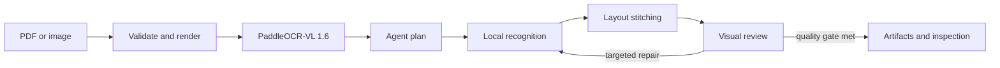

# Paperplane

[](https://github.com/pypi-ahmad/Agentic-Document-Extraction/actions/workflows/ci.yml)
[](https://github.com/pypi-ahmad/Agentic-Document-Extraction/releases)
[](https://www.python.org/downloads/)
[](LICENSE)

Paperplane turns PDFs and document images into auditable, layout-aware, LLM-ready
Markdown and structured data. It is built for scans, native PDFs, mixed batches,
multi-column pages, tables, figures, formulas, forms, and other documents where flat
text extraction loses context.

The primary parser is the official **PaddleOCR-VL 1.6 pipeline**, run in an isolated
GPU Docker container. Optional Ollama or cloud vision models can recognize difficult
regions and review the assembled page. Every accepted block retains its page,
coordinates, reading order, source, and confidence.

> Paperplane is inspired by public ideas from LandingAI ADE and LlamaParse. It is an
> independent implementation and does not call either hosted service or claim their
> published benchmark results.

## What it produces

- Hierarchical clean and citation-rich Markdown
- Canonical text, table, figure, form, and table-cell blocks
- RAG-ready context chunks with heading paths and bounding boxes
- Schema-shaped extraction with value-level evidence
- Mixed-file sub-document classification and manifests
- Annotated and optional searchable PDFs
- Page diagnostics, recognition candidates, quality reports, and warnings
- Figure crops and reproducible per-document or batch ZIP bundles

## How it works



PaddleOCR-VL supplies layout, reading order, OCR, tables, formulas, figures, and
structured regions. GLM-OCR or another selected vision model gets a separate local
recognition pass for scanned or disputed regions. An optional cloud reviewer evaluates
the page image and draft without replacing the local parser. Cloud disagreement can
trigger a blind local retry: the local model sees the crop, never the cloud answer.

LangGraph bounds this decision loop, while SQLite page checkpoints make completed work
resumable. See [How Paperplane works](docs/how-it-works.md) for the user-level flow and
[Architecture](docs/ARCHITECTURE.md) for implementation details.

## Processing modes

| Mode | Behavior | Tradeoff |
|---|---|---|
| `local_only` | PaddleOCR-VL plus configured local recognition; no cloud calls | Maximum privacy and no API cost |
| `hybrid` | Cloud review only for locally flagged pages or unresolved schema values | Balanced cost and accuracy |
| `maximum_accuracy` | Cloud review for all selected pages plus independent verification paths | Highest latency and API use |

Cloud use is explicit. Sensitive auto-detected profiles require consent before content
is sent to a configured cloud provider.

## Runtime topology

| Component | Responsibility |
|---|---|
| Next.js frontend | Upload, settings, progress, inspection, reprocessing, and downloads |
| FastAPI backend | Validation, APIs, queue ownership, lifecycle, and security boundaries |
| LangGraph | Page pipeline, conditional repair, and durable execution checkpoints |
| PaddleOCR-VL Docker worker | GPU document parsing in batches of at most 10 pages |
| Ollama or cloud provider | Optional recognition, review, and schema completion |
| SQLite and artifact store | Jobs, page state, evaluation data, source files, and outputs |

## Requirements

- Windows 11 with Docker Desktop/WSL2, or Linux
- Python 3.12.10 and `uv`
- Node.js 20 or newer and npm
- Docker Desktop or Docker Engine with NVIDIA Container Toolkit support
- An NVIDIA GPU for the official PaddleOCR-VL image
- Ollama only when local GLM recognition or local visual review is wanted

The official parser path requires an NVIDIA-capable Docker runtime; Docker Desktop on
macOS cannot provide that runtime. The host Python environment does not install
PaddlePaddle. PaddleOCR-VL and its CUDA runtime stay inside the pinned container image.

## Quick start

The following is the Windows PowerShell path. The complete PowerShell and Bash command
reference is in [Run Paperplane](docs/RUN_APP.md).

```powershell
git clone https://github.com/pypi-ahmad/Agentic-Document-Extraction.git
cd Agentic-Document-Extraction
uv python install 3.12.10
uv sync --locked
if (-not (Test-Path .env)) { Copy-Item backend/.env.example .env }
```

Verify Docker GPU access and pull the pinned PaddleOCR-VL image:

```powershell
docker run --rm --gpus all nvidia/cuda:12.6.3-base-ubuntu24.04 nvidia-smi
docker pull ccr-2vdh3abv-pub.cnc.bj.baidubce.com/paddlepaddle/paddleocr-vl:latest-nvidia-gpu@sha256:ad0b1f056a76967f9191cd06398e8babb21b49a4673a28c3de5fd31f481884db
New-Item -ItemType Directory -Force .cache\paddleocr-vl
```

Optional local recognition and review:

```powershell
ollama serve
```

In another terminal after Ollama is ready:

```powershell
ollama pull glm-ocr:latest
ollama pull qwen3.5:9b
```

Start the backend from the repository root:

```powershell
uv run uvicorn app.main:app --app-dir backend --reload --reload-dir backend --host 127.0.0.1 --port 8000
```

Start the frontend in another terminal:

```powershell
cd frontend
npm ci
npm run dev
```

Open <http://localhost:3000>. API documentation is available at
<http://localhost:8000/docs>; liveness and dependency readiness are exposed at
`/health` and `/health/ready`.

The first parse may download Paddle model assets into `.cache/paddleocr-vl`. Later jobs
reuse that cache. The backend never pulls the Docker image automatically.

## Main capabilities

- **Document inspection:** synchronized document tree, page image, bounding boxes,
  reading order, Markdown, retained recognition candidates, and quality metrics.
- **Selective reprocessing:** rerun a page or region at 150, 200, or 300 DPI with
  configurable crop padding; a quality gate accepts only an improved result.
- **Batch processing:** upload multiple files with shared settings and download a batch
  ZIP containing successful bundles plus failure metadata.
- **Mixed-document splitting:** classify page ranges and detect repeated identifiers
  such as invoice numbers, dates, and order IDs without repeating OCR.
- **Schema-first extraction:** resolve flat or nested fields, arrays, and large tables
  against canonical block IDs, with citations for accepted values.
- **Evaluation and curation:** compare output with grounded labels and capture review
  cases for systematic quality improvement.

## Persistence and recovery

The application database is authoritative for job, page, artifact, batch, schema,
evaluation, and review-case metadata. LangGraph uses a separate SQLite checkpointer.
Document bytes and generated outputs live under the configured upload and artifact
directories.

One document job runs at a time to bound GPU and memory use. Long documents are split
into consecutive batches of at most 10 pages. Successful page checkpoints are committed
before the next batch; resume and failed-page retry skip valid pages. Partial exports
explicitly identify missing pages.

Alembic migrations run during backend startup. Back up an existing database before
crossing the destructive `0005_markdown_parser_reset` migration.

## Configuration

Copy `backend/.env.example` to `.env`. Important settings include:

| Variable | Default | Purpose |
|---|---|---|
| `DATABASE_URL` | `sqlite+aiosqlite:///./extraction.db` | Application metadata database |
| `LANGGRAPH_CHECKPOINT_PATH` | `./parser_checkpoints.sqlite` | Workflow checkpoint database |
| `UPLOAD_DIR` / `ARTIFACTS_DIR` | local directories | Source and artifact storage |
| `PADDLEOCR_VL_IMAGE` | pinned 1.6 GPU image digest | Reproducible parser runtime |
| `PADDLEOCR_VL_CACHE_DIR` | `./.cache/paddleocr-vl` | Persistent Paddle model cache |
| `OLLAMA_BASE_URL` | `http://localhost:11434` | Local model endpoint |
| `OPENAI_API_KEY`, `ANTHROPIC_API_KEY`, `GEMINI_API_KEY`, `XAI_API_KEY` | empty | Optional cloud providers |
| `API_KEY` | empty | Optional `X-API-Key` protection for `/api/*` |
| `PAPERPLANE_BACKEND_ORIGIN` | `http://127.0.0.1:8000` | Next.js API proxy destination |

Model names are selected in the UI. Ollama models are discovered at runtime and must
advertise both `vision` and `completion` capabilities. API keys remain server-side and
must be supplied through environment variables; never put them in frontend settings.

## Development checks

```powershell
uv sync --locked --extra test --extra lint --extra docs
uv run --no-sync ruff format --check backend/app backend/tests scripts
uv run --no-sync ruff check backend/app backend/tests scripts
uv run --no-sync pyright
uv run --no-sync pytest backend/tests/unit -q -p no:cacheprovider

cd frontend
npm ci
npx tsc --noEmit
npm run lint
npm test -- --run
npm run build
```

## Documentation map

- [Run Paperplane](docs/RUN_APP.md) — command-only PowerShell and Bash reference
- [How Paperplane works](docs/how-it-works.md) — stages, models, modes, and outputs
- [Architecture](docs/ARCHITECTURE.md) — components, contracts, persistence, and failures
- [Zero to Mastery](docs/ZERO_TO_MASTERY.md) — guided codebase tutorial and exercises
- [Quality](docs/QUALITY.md) — diagnostics and quality behavior
- [Deployment](docs/DEPLOYMENT.md) — deployment and operational boundaries
- [Runbook](docs/RUNBOOK.md) — incident and recovery procedures
- [Contributing](CONTRIBUTING.md) — contribution workflow

## Limits and security

Paperplane is a single-workstation, single-operator application, not a distributed
million-page service. The configured default limit is 500 pages and 200 MB per document.
It has no built-in user accounts or tenant isolation. Set `API_KEY`, restrict CORS, use
TLS, and place it behind access control before exposing it beyond localhost.

Source files, crops, OCR text, and model prompts may contain sensitive data. Local-only
mode keeps model processing local; selecting a cloud provider sends the relevant page or
crop to that provider. Logs record boundaries and model metadata, not API keys.

## License

[MIT](LICENSE)
