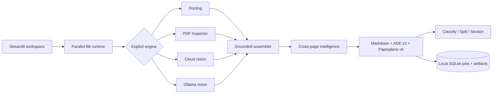

# Paperplane

[](https://github.com/pypi-ahmad/Agentic-Document-Extraction/actions/workflows/ci.yml)
[](https://github.com/pypi-ahmad/Agentic-Document-Extraction/releases/latest)
[](https://www.python.org/)
[](https://streamlit.io/)
[](LICENSE)

**A private, local Streamlit workspace for turning PDFs, images, and modern Office files
into context-aware Markdown, grounded JSON, cited organization results, and annotated PDFs.**

Repository: [github.com/pypi-ahmad/Agentic-Document-Extraction](https://github.com/pypi-ahmad/Agentic-Document-Extraction)

Paperplane 5 is inspired by LandingAI ADE's observable Parse workflow and evidence model. It is
an independent implementation: it does not call LandingAI, promise API drop-in
compatibility, or claim LandingAI accuracy parity.

## Features

- Upload up to 20 files and process up to six concurrently, with an independent one-based
  page range for every file.
- Choose exactly one engine: **Docling ADE**, **PDF Inspector ADE**, **Cloud AI ADE**, or
  **Ollama ADE**. Nothing is selected or routed automatically.
- Optionally run cloud enhancement after Docling, PDF Inspector, or Ollama.
- Discover every installed Ollama model and disable Parse when the selected model does not
  advertise vision support.
- Keep reading order and prior selected-page context; infer section starts, repeated
  marginalia, and conservative continued-table relationships across pages.
- Export layout-aware Markdown, an annotated PDF, strict ADE v2-style Parse JSON, and a
  richer `paperplane.parse.v5` JSON document, plus sanitized standalone HTML.
- Use one shared document selector across full-width Input preview, Output, Annotated PDF,
  Markdown, HTML, and JSON tabs. Download the selected document's outputs or one batch ZIP
  with a versioned success/failure manifest.
- Ground blocks and atomic lines to Unicode Markdown ranges and normalized boxes. Native
  PDF words and RapidOCR-observed words are emitted only when exact text alignment exists.
- Run cited Classify, Split, and Section workflows from the **Organize** page.
- Retain job metadata, source files, result JSON, and annotated PDFs under
  `%LOCALAPPDATA%\Paperplane` for seven days, with per-job and clear-all deletion.
- Track raw confidence separately from version/corpus-pinned calibrated confidence.
- Validate a locked benchmark manifest and publish transparent result artifacts through
  GitHub Pages without a `gh-pages` branch.
- Bootstrap missing Windows requirements once, then launch directly by double-clicking
  `Paperplane.cmd`.

## Workspace pages

| Page | Purpose |
|---|---|
| Parse | Sidebar setup, parallel processing, full-width previews/outputs, and downloads |
| Organize | Classify, Split, and Section workflows with source ranges |
| Jobs | Seven-day local history, status, cancellation state, and deletion |
| Benchmarks | Corpus integrity, engine matrix, metrics, and measured result bundles |

## Supported inputs

| Input | Docling | PDF Inspector | Cloud AI | Ollama |
|---|---:|---:|---:|---:|
| PDF | Yes | Yes | Yes | Yes |
| PNG, JPEG, WebP, TIFF, BMP | Yes | No | Yes | Yes |
| DOCX, PPTX, XLSX, ODT, ODP, ODS, CSV | Yes | No | Yes, after local PDF conversion | Yes, after local PDF conversion |

LibreOffice performs isolated temporary Office conversion. Encrypted PDFs and legacy
DOC/PPT/XLS files are not supported. Pages outside a chosen range are never inspected.

## Outputs and contracts

- **Markdown:** global reading order with explicit page breaks.
- **Annotated PDF:** source overlays where geometry exists; semantic evidence otherwise.
- **ADE v2 JSON:** documented-style `markdown`, `metadata`, and hierarchical `structure`
  with zero-based response-local IDs and inline grounding.
- **Paperplane JSON:** namespaced provenance, observed words, confidence status, warnings,
  and cross-page relations around the ADE-compatible core.
- **HTML:** sanitized standalone rendering of the layout-aware Markdown.
- **Batch ZIP:** every successful document's available outputs in traversal-safe folders,
  plus a versioned manifest for successes and failures. Original uploads are not duplicated.
“ADE-compatible” in v5 describes these versioned Python/Pydantic and JSON contracts plus
durable job semantics. Paperplane does not expose a local/public HTTP API in this release.

## Tech stack

Python 3.12, Streamlit, Pydantic, SQLite, HTTPX, PyMuPDF, Pillow, Python-Markdown,
Bleach, Docling + RapidOCR, Firecrawl PDF Inspector, LibreOffice, uv, Pytest, Ruff,
Pyright, and GitHub Actions.

## Project structure

```text
Agentic-Document-Extraction/
├── workspace_app.py             # Multipage Streamlit entrypoint
├── streamlit_app.py             # Parse page
├── app_pages/                   # Organize, Jobs, Benchmarks
├── Paperplane.cmd               # One-file Windows setup and launcher
├── paperplane/
│   ├── ade_contracts.py         # ADE v2 + Paperplane v5 exports and engine options
│   ├── ade_workflows.py         # Classify, Split, Section
│   ├── jobs.py                  # SQLite job lifecycle and artifact retention
│   ├── ollama_document.py       # Ollama discovery, vision, and cloud chaining
│   ├── document_intelligence.py # Cross-page semantic relationships
│   ├── calibration.py           # Profile-pinned confidence calibration
│   ├── benchmark.py             # Locked manifests and metric helpers
│   ├── runtime.py               # Parallel file processing and provider composition
│   ├── outputs.py               # Sanitized HTML and safe batch ZIP exports
│   ├── parser.py                # Page-range parsing and document assembly
│   ├── docling_parser.py        # Local layout/table/OCR parsing
│   └── pdf_inspector_parser.py  # PDF Inspector adapter
├── benchmarks/                  # Locked corpus manifest and transparency policy
├── tests/                       # Contracts, adapters, runtime, UI, and workflow tests
├── docs/                        # Architecture, setup, quality, and operations
├── Sample-PDF/                  # Public example document
├── .env.example                 # Portable configuration template
├── pyproject.toml
└── uv.lock
```

## Setup

### Windows one-click setup

1. Clone or download the repository.
2. Double-click `Paperplane.cmd`.
3. Open [http://127.0.0.1:8551](http://127.0.0.1:8551) if the browser does not open.

The launcher installs uv, Python 3.12.10, LibreOffice, locked CPU/CUDA dependencies, and
Docling/RapidOCR models only when they are missing or out of date. Once ready, it skips
setup and starts `workspace_app.py` directly on port `8551`.

### Manual setup

```powershell
git clone https://github.com/pypi-ahmad/Agentic-Document-Extraction.git
cd Agentic-Document-Extraction
uv python install 3.12.10
uv sync --locked --extra cpu
uv run --locked --extra cpu docling-tools models download layout tableformer rapidocr --quiet
uv run --locked --extra cpu streamlit run workspace_app.py --server.port=8551
```

Install and start [Ollama](https://ollama.com/) separately for Ollama ADE. Paperplane lists
the models returned by the local server; `glm-ocr:latest` and
`AuditAid/PaddleOCR-VL-1.6-0.9B:latest` are the initial calibration targets, not required
hard-coded choices.

## Environment variables

| Variable | Purpose |
|---|---|
| `OPENAI_API_KEY` | GPT-5.6 Luna and compatible OpenAI endpoint authentication |
| `OPENAI_BASE_URL` | Optional OpenAI-compatible base URL; default `https://api.openai.com` |
| `XAI_API_KEY` | Grok 4.6 |
| `GEMINI_API_KEY` | Gemini 3.5 Flash-Lite and Gemini 3.6 Flash |
| `ANTHROPIC_API_KEY` | Claude Sonnet 5 |
| `AGNES_API_KEY` | Agnes 2.5 Flash text workflows and approved public benchmark assets |
| `OLLAMA_BASE_URL` | Local Ollama server; default `http://127.0.0.1:11434` |

Paperplane reads process/Windows user variables first, then an ignored `.env`, then
Streamlit secrets. `.env.example` remains available for other machines. Never commit a
real credential.

Agnes currently requires publicly accessible image URLs. Paperplane therefore blocks
private visual Parse/enhancement with Agnes in v5; other Agnes text workflows remain
available. Agnes usage is recorded even though its configured price is $0.

## Usage

1. Open **Parse** and activate one engine toggle.
2. Choose a cloud model or installed vision-capable Ollama model when relevant.
3. Optionally enable cloud enhancement for a local engine.
4. Upload documents and choose each file's page range.
5. Select **Parse files** and use the shared document selector with Input preview, Output,
   Annotated PDF, Markdown, HTML, and JSON.
6. Download individual outputs for the selected document or **Download batch ZIP** for the
   whole batch.
7. Continue to **Organize** for cited Classify, Split, and Section workflows.
8. Use **Jobs** to inspect or delete retained local artifacts.

## High-level architecture



Files stay isolated from one another. Within one file, selected pages remain ordered and
prior selected-page content can guide later AI pages. Deterministic local workflows return
explicit partials/warnings when semantics are unsupported; they do not silently call a
different engine.

## Quality and benchmarks

The locked manifest is [`benchmarks/manifest.json`](benchmarks/manifest.json). It names
text, reading-order, table, continuation, grounding, workflow, calibration,
latency, token, and cost metrics. The initial corpus is intentionally too small for an
accuracy claim. Paperplane publishes no score until raw outputs and all required provenance
exist, and never transfers LandingAI's DPT-2 DocVQA result to this implementation.

## Development

```powershell
uv sync --locked --extra cpu --extra test --extra lint --extra docs
uv run ruff check paperplane app_pages tests streamlit_app.py workspace_app.py scripts
uv run ruff format --check paperplane app_pages tests streamlit_app.py workspace_app.py scripts
uv run pyright
uv run pytest -q
```

## Documentation

- [Setup](docs/SETUP.md) · [Run guide](docs/RUN_APP.md) · [Architecture](docs/ARCHITECTURE.md)
- [Engines](docs/ENGINES.md) · [Models](docs/MODELS.md) · [Quality](docs/QUALITY.md)
- [Limitations](docs/LIMITATIONS.md) · [Runbook](docs/RUNBOOK.md)
- [Contributor onboarding](ONBOARDING.md) · [Release process](RELEASE.md)

## License

[MIT](LICENSE)

## Acknowledgements

Paperplane builds on Streamlit, Docling, RapidOCR, Firecrawl PDF Inspector, LibreOffice,
PyMuPDF, Ollama, and provider-native multimodal APIs. LandingAI ADE inspired the observable
workflow and evidence contract, while Paperplane remains independent.
