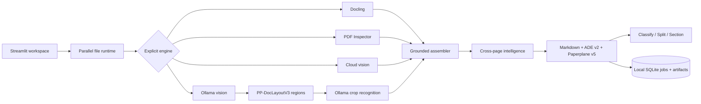

# Paperplane

[](https://github.com/pypi-ahmad/Agentic-Document-Extraction/actions/workflows/ci.yml)
[](https://github.com/pypi-ahmad/Agentic-Document-Extraction/releases/latest)
[](https://www.python.org/)
[](https://streamlit.io/)
[](LICENSE)

**An open-source, local-first Streamlit workspace for turning PDFs, images, and modern Office files
into context-aware Markdown, grounded JSON, cited organization results, and annotated PDFs.**

Repository: [github.com/pypi-ahmad/Agentic-Document-Extraction](https://github.com/pypi-ahmad/Agentic-Document-Extraction)

Current stable release: [Paperplane v5.3.0](https://github.com/pypi-ahmad/Agentic-Document-Extraction/releases/tag/v5.3.0)

Paperplane 5 is inspired by LandingAI ADE's observable Parse workflow and evidence model. It is
an independent implementation: it does not call LandingAI, promise API drop-in
compatibility, or claim LandingAI accuracy parity.

## What is Paperplane?

Paperplane turns PDFs, images, scans, and modern Office files (DOCX, PPTX, XLSX, and their
OpenDocument equivalents) into structured, evidence-backed output: reading-order Markdown, an
annotated PDF, and two JSON flavors — an ADE v2-style export and a richer `paperplane.parse.v5`
export with full provenance. Every emitted block carries grounding back to the source page and
text range wherever that evidence exists, instead of silently guessing.

You explicitly pick exactly one processing engine per run — **Docling ADE** (local layout, table,
and OCR), **PDF Inspector ADE** (local PDF-only inspection), **Cloud AI ADE** (a selected
multimodal provider), or **Ollama ADE** (a locally installed vision model) — with optional cloud
enhancement layered on top of a local engine. Nothing is auto-routed or silently escalated to the
cloud. Everything runs on your own machine (`127.0.0.1:8551`), keeps uploads and results
session-only in the browser, and uses only the API keys and credentials you supply. See
[Disclaimer and User Responsibility](DISCLAIMER.md) for what that means in practice.

Downstream, the **Organize** page runs deterministic, citation-grounded Classify, Split, and
Section workflows directly on a completed Parse result — no second model call, no re-inference.

## Contents

- [What is Paperplane?](#what-is-paperplane)
- [Open source and user responsibility](#open-source-and-user-responsibility)
- [Features](#features)
- [Feature guide](#feature-guide)
- [Workspace pages](#workspace-pages)
- [Supported inputs](#supported-inputs)
- [Outputs and contracts](#outputs-and-contracts)
- [Tech stack](#tech-stack)
- [Project structure](#project-structure)
- [Setup](#setup)
- [Environment variables](#environment-variables)
- [Usage](#usage)
- [High-level architecture](#high-level-architecture)
- [Quality and benchmarks](#quality-and-benchmarks)
- [Development](#development)
- [Documentation](#documentation)
- [License](#license)
- [Acknowledgements](#acknowledgements)

## Open source and user responsibility

Paperplane is MIT-licensed software intended to run on your own machine. Cloning, forking,
using, modifying, and contributing are welcome. See [CONTRIBUTING.md](CONTRIBUTING.md) and
the [Code of Conduct](CODE_OF_CONDUCT.md) before opening a pull request.

Testers and users can [report bugs](https://github.com/pypi-ahmad/Agentic-Document-Extraction/issues/new?template=bug_report.yml),
[request features](https://github.com/pypi-ahmad/Agentic-Document-Extraction/issues/new?template=feature_request.yml),
or support the project by starring, sharing, testing, and contributing.
Paperplane does not accept donations, sponsorships, or any other financial support — the
project is free and community-driven, and it stays that way.
See [Support](SUPPORT.md), [Security](SECURITY.md), and the canonical
[Disclaimer and User Responsibility](DISCLAIMER.md).

You are responsible for every document and other file you choose to process, including
having the necessary rights or permission, deciding whether its contents may be sent to a
cloud provider, and complying with applicable privacy, copyright, contractual, and
regulatory requirements. You also provide and secure any third-party API keys you choose
to use, accept the provider's terms, data practices, and charges, validate generated
outputs, and delete retained local artifacts when required.

Docling, PDF Inspector, and loopback Ollama processing remain local. Cloud AI and optional
cloud enhancement transmit selected page content to the chosen provider. Paperplane is not
a hosted service, and its maintainers do not receive your documents or credentials through
the project.

## Features

- Upload up to 20 files and 1 GiB per batch, process up to six files concurrently, and use
  an independent one-based page range for every file. Each file may contain up to 500 pages
  and occupy up to 200 MiB.
- Follow a live batch progress bar with the current document, page or output stage, and a
  monotonic completion percentage that reaches 100% even when a document fails.
- Choose exactly one engine: **Docling ADE**, **PDF Inspector ADE**, **Cloud AI ADE**, or
  **Ollama ADE**. Nothing is selected or routed automatically.
- Optionally run cloud enhancement after Docling, PDF Inspector, or Ollama.
- Discover every installed Ollama model and disable Parse when the selected model does not
  advertise vision support.
- Run GLM-OCR, PaddleOCR-VL, and DeepSeek-OCR through local PP-DocLayoutV3 page regions
  and family-native crop prompts instead of whole-page structured JSON.
- Keep reading order and prior selected-page context; infer section starts, repeated
  marginalia, and conservative continued-table relationships across pages.
- Export layout-aware Markdown, an annotated PDF, strict ADE v2-style Parse JSON, and a
  richer `paperplane.parse.v5` JSON document, plus sanitized standalone HTML.
- Use one shared document selector across full-width Input preview, Output, Annotated PDF,
  Markdown, HTML, and JSON tabs. Download the selected document's outputs or one batch ZIP
  with a versioned success/failure manifest.
- Ground blocks and atomic lines to Unicode Markdown ranges and normalized boxes. Native
  PDF words and RapidOCR-observed words are emitted only when exact text alignment exists.
- Run cited Classify, Split, and Section workflows from the **Organize** page.
- Retain job metadata, source files, result JSON, and annotated PDFs under
  `%LOCALAPPDATA%\Paperplane` for seven days, with per-job and clear-all deletion.
- Track raw confidence separately from version/corpus-pinned calibrated confidence.
- Validate a locked benchmark manifest and publish transparent result artifacts through
  GitHub Pages without a `gh-pages` branch.
- Bootstrap missing requirements once with `Paperplane.cmd` on Windows or `Paperplane.sh`
  on Linux, then skip completed setup on later launches. The platform runner avoids noisy
  Windows connection-reset tracebacks without changing Linux event-loop behavior.
- Start every launcher run with empty UI caches and replace the active output when a new
  parse begins. Normal page navigation preserves the current workspace.
- Use **Stop and clear** from any page to clear Streamlit and session caches, blank every
  Paperplane tab in the same browser, and stop the local backend and launcher. Downloaded
  models, job history, and saved artifacts remain available.

## Feature guide

### Stop and clear from any page

The shared sidebar includes a confirmation-protected **Stop and clear** control on Parse,
Organize, Jobs, and Cost. Confirming it clears in-memory Streamlit data and resource
caches plus the active session, notifies other Paperplane tabs in the same browser to close
their UI, and exits the local server successfully. Browsers with JavaScript disabled show a
disconnected page instead. Local models and retained job artifacts are not deleted.

### Four explicit processing engines

Paperplane never chooses an engine automatically. Activating one engine turns the other
three off, so users always know where document content is processed.

- **Docling ADE** runs local layout analysis, table recognition, reading-order recovery,
  and OCR through Docling and RapidOCR. It accepts every supported input type and is the
  full-layout local choice when documents should remain on the machine.
- **PDF Inspector ADE** inspects PDFs locally for Markdown, positioned text, page geometry,
  and OCR indicators. It accepts PDF files only.
- **Cloud AI ADE** renders selected pages and sends them to one explicitly selected
  multimodal provider. It is intended for scans, images, and documents where visual
  interpretation is more important than local-only processing.
- **Ollama ADE** uses an installed local Ollama model. Paperplane lists every installed
  model but enables Parse only when Ollama reports the `vision` capability. GLM-OCR,
  PaddleOCR-VL, and DeepSeek-OCR first receive CPU-detected PP-DocLayoutV3 regions with
  family-native prompts; detector boxes ground the assembled blocks.

For Docling, PDF Inspector, and Ollama, **Enhance with cloud AI** can pass the local result
to a selected cloud model for refinement. Enhancement is opt-in and requires that
provider's credential; Paperplane does not silently fall back to cloud processing.

### Fast, Balanced, and Audit quality modes

Cloud processing and cloud enhancement expose three inspection depths:

| Mode | Behavior | Best for |
|---|---|---|
| Fast | 150 DPI draft, deterministic grounding, no separate verification pass | Straightforward, high-volume documents |
| Balanced | 200 DPI draft with 300 DPI verification crops for flagged regions | Most documents |
| Audit | 250 DPI draft, 400 DPI crops, deeper reasoning, and up to three repair rounds | Difficult scans, tables, identifiers, and ambiguous layouts |

Balanced verifies only suspicious content; Audit inspects complex regions more broadly.
These modes trade latency and provider usage for verification depth—they do not change the
output contract.

### Supported cloud models and private visual input

The Cloud AI selector contains Grok 4.6, GPT-5.6 Luna, Gemini 3.5 Flash-Lite, Gemini 3.7
Flash, Claude Sonnet 5, and Agnes 2.5 Flash. Each provider uses its native API boundary and
only its corresponding environment variable. GPT-5.6 Luna is selected by default. The UI
records provider-reported input and output tokens and shows a configured cost estimate;
that estimate is not an invoice.

Agnes visual Parse and enhancement use inline PNG data URLs. Uploaded images do not need
to be published at a public URL. Paperplane requests schema tool calls from Agnes and also
accepts its JSON content response. Paperplane normalizes equivalent 0–1000 boxes and omitted
nullable chunk fields before local validation and one bounded correction attempt. All cloud models still
receive the selected page content, so use Docling, PDF Inspector, or Ollama when content
must not leave the machine.

### Page selection, isolation, and document context

Every uploaded file has an independent, one-based inclusive page range. Pages outside that
range are not rendered, parsed, or added to model context. Up to 20 files can be queued in
one batch and up to six files run concurrently, but files never share content or context.

Within a single file, selected pages retain physical order. Later AI-processed pages may
receive bounded Markdown context from earlier selected pages, improving continued tables,
section continuity, and repeated-label handling without crossing document boundaries.

### Grounded structure and document intelligence

Paperplane assembles a document → page → block hierarchy containing titles, headings,
text, lists, checkboxes, tables and cells, form fields, figures, charts, headers, and
footers. Blocks and atomic lines carry normalized page boxes and half-open Unicode ranges
into the final Markdown.

Native PDF words and RapidOCR observations are exported only when they align exactly with
the Markdown; missing evidence remains missing instead of being guessed. Cross-page logic
then marks section starts, repeated marginalia, continued tables, parent/child structure,
and page-range boundaries. Each result retains provenance, warnings, source passes,
verification state, and raw or calibrated confidence status.

On Windows NVIDIA systems, Paperplane isolates PyTorch's bundled CUDA/cuDNN runtime from
incompatible CUDA Toolkit DLLs inherited through `PATH`. Launcher health checks also reject
missing Torch `RECORD` metadata and exercise a small CUDA convolution before startup. Existing
test, lint, and documentation tools are preserved during runtime dependency synchronization.
Docling with cloud enhancement describes detected figures with the selected cloud model and
includes those tokens in the session cost; plain Docling keeps a local placeholder without
reporting that expected limitation as a processing failure.

### Parse workspace and red/black dark theme

The checked-in Streamlit theme uses a near-black canvas, charcoal panels, red controls,
dark-red borders, and high-contrast text. Parse configuration stays in the sidebar while a
single selected-document control drives six full-width views:

- **Input preview** shows only the current inclusive page range for PDFs.
- **Output** presents the assembled result and usage summary.
- **Annotated PDF** overlays grounded regions and previews only the successfully parsed PDF
  range when source geometry is available.
- **Markdown** exposes the reading-order document text.
- **HTML** renders allowlist-sanitized content on a responsive white paper surface with
  black text, matching the standalone download.
- **JSON** switches between strict ADE v2-style and richer Paperplane v5 exports.

Preview filtering is display-only: the annotated-PDF download remains the complete source
PDF with overlays on parsed pages. Downloads always follow the selected document. The batch ZIP instead includes every
successful document's available artifacts plus a versioned manifest describing successes,
failures, and artifact warnings; it intentionally does not duplicate original uploads.

### Cited Organize workflows

The **Organize** page operates on a completed Parse result without reparsing the file:

- **Classify** assigns pages to a user-provided allowed class list and returns source page
  ranges.
- **Split** groups classified page ranges into logical documents.
- **Section** detects document sections and provides a downloadable `sections.json` map.

These workflows use the grounded result and preserve citations. When evidence is
insufficient or semantics are unsupported, they return explicit partial results and
warnings rather than invoking another model or fabricating certainty.

### Durable local jobs and deletion controls

The **Jobs** page stores job metadata, checkpoints, source artifacts, result JSON, and
annotated PDFs under `%LOCALAPPDATA%\Paperplane`. Retention is seven days; expired jobs are
purged automatically. Users can inspect status, mark a pending/running job cancelled,
delete one job and its artifact directory, or clear all retained jobs.

Execution still occurs inside the Streamlit process. Closing the app stops active
computation; retained records remain available when Paperplane is reopened. This is not a
remote queue or multi-user database.

### Session cost and transparent benchmarks

The **Cost** page accumulates provider-reported input, cached-input, and output tokens for
successful parses in the current browser session. It groups usage and configured price
estimates by model and shows a combined total. Free and local models contribute token
counts at $0 API cost. **New parse** keeps this ledger; **Stop and clear** or ending the
session removes it.

Version-pinned benchmark manifests, document hashes, metrics, and result bundles remain
available in the checked-in benchmark workflow without a dedicated workspace page.

Confidence calibration logic exists in `paperplane/calibration.py`, but no calibration profile
ships with Paperplane and the parse/export pipeline does not yet call it. Every result reports
raw, uncalibrated confidence today. The initial corpus is too small for a comparative accuracy
claim, and Paperplane does not inherit LandingAI scores.

## Workspace pages

| Page | Purpose |
|---|---|
| Parse | Sidebar setup, parallel processing, full-width previews/outputs, and downloads |
| Organize | Classify, Split, and Section workflows with source ranges |
| Jobs | Seven-day local history, status, cancellation state, and deletion |
| Cost | Per-session tokens and configured cost estimates grouped by model, plus totals |

## Supported inputs

| Input | Docling | PDF Inspector | Cloud AI | Ollama |
|---|---:|---:|---:|---:|
| PDF | Yes | Yes | Yes | Yes |
| PNG, JPEG, WebP, TIFF, BMP | Yes | No | Yes | Yes |
| DOCX, PPTX, XLSX, ODT, ODP, ODS, CSV | Yes | No | Yes, after local PDF conversion | Yes, after local PDF conversion |

LibreOffice performs isolated temporary Office conversion. Encrypted PDFs and legacy
DOC/PPT/XLS files are not supported. Pages outside a chosen range are never inspected.

## Outputs and contracts

- **Markdown:** global reading order with explicit page breaks.
- **Annotated PDF:** source overlays where geometry exists; semantic evidence otherwise.
- **ADE v2 JSON:** documented-style `markdown`, `metadata`, and hierarchical `structure`
  with zero-based response-local IDs and inline grounding.
- **Paperplane JSON:** namespaced provenance, observed words, confidence status, warnings,
  and cross-page relations around the ADE-compatible core.
- **HTML:** sanitized, print-friendly standalone rendering of the layout-aware Markdown on
  a responsive white page with black text. The in-app preview, individual download, and
  HTML files inside the batch ZIP share this presentation.
- **Batch ZIP:** every successful document's available outputs in traversal-safe folders,
  plus a versioned manifest for successes and failures. Original uploads are not duplicated.
“ADE-compatible” in v5 describes these versioned Python/Pydantic and JSON contracts plus
durable job semantics. Paperplane does not expose a local/public HTTP API in this release.

## Tech stack

Python 3.12, Streamlit, Pydantic, SQLite, HTTPX, PyMuPDF, Pillow, Python-Markdown,
Bleach, Docling + RapidOCR, Transformers + PP-DocLayoutV3, Firecrawl PDF Inspector,
LibreOffice, uv, Pytest, Ruff, Pyright, and GitHub Actions.

## Project structure

```text
Agentic-Document-Extraction/
├── workspace_app.py             # Multipage Streamlit entrypoint
├── streamlit_app.py             # Parse page
├── app_pages/                   # Organize, Jobs, Cost
├── Paperplane.cmd               # One-file Windows setup and launcher
├── Paperplane.sh                # One-file Linux setup and launcher
├── paperplane/
│   ├── ade_contracts.py         # ADE v2 + Paperplane v5 exports and engine options
│   ├── ade_workflows.py         # Classify, Split, Section
│   ├── jobs.py                  # SQLite job lifecycle and artifact retention
│   ├── model_store.py           # Permanent versioned Docling/RapidOCR/layout weights
│   ├── ollama_document.py       # Ollama discovery, vision, and cloud chaining
│   ├── ollama_ocr.py            # Local layout detection and OCR-family prompts
│   ├── document_intelligence.py # Cross-page semantic relationships
│   ├── calibration.py           # Profile-pinned confidence calibration
│   ├── benchmark.py             # Locked manifests and metric helpers
│   ├── runtime.py               # Parallel file processing and provider composition
│   ├── outputs.py               # Sanitized HTML and safe batch ZIP exports
│   ├── parser.py                # Page-range parsing and document assembly
│   ├── docling_parser.py        # Local layout/table/OCR parsing
│   └── pdf_inspector_parser.py  # PDF Inspector adapter
├── benchmarks/                  # Locked corpus manifest and transparency policy
├── tests/                       # Contracts, adapters, runtime, UI, and workflow tests
├── docs/                        # Architecture, setup, quality, and operations
├── Sample-PDF/                  # Public example document
├── .env.example                 # Portable configuration template
├── pyproject.toml
└── uv.lock
```

## Setup

### Windows one-click setup

1. Clone or download the repository.
2. Double-click `Paperplane.cmd`.
3. Open [http://127.0.0.1:8551](http://127.0.0.1:8551) if the browser does not open.

The launcher installs uv, Python 3.12.10, LibreOffice, locked CPU/CUDA dependencies, and
the required Docling, RapidOCR, and PP-DocLayoutV3 weights. Existing caches are migrated
without a network download. The weights then remain in the versioned Paperplane model
store. Each launch verifies every manifest path and file size before starting on port
`8551`; SHA-256 hashes are calculated when migration or download finalizes a model set, or
when a missing manifest is rebuilt. A healthy pinned set is reused offline, while missing
or incomplete files are repaired or downloaded.

### Linux one-file setup

On Ubuntu or Debian:

```bash
./Paperplane.sh
```

If the executable bit was lost while downloading an archive, run
`chmod +x Paperplane.sh` once. The launcher installs missing `uv`, Python 3.12.10,
LibreOffice through APT, locked CPU/CUDA dependencies, and the permanent Paperplane model
store. It selects CUDA when `nvidia-smi` works and falls back to CPU if
the locked CUDA environment cannot be synchronized. On other Linux distributions, install
LibreOffice first and rerun the same launcher; it does not guess privileged package-manager
commands.

### Manual setup

```powershell
git clone https://github.com/pypi-ahmad/Agentic-Document-Extraction.git
cd Agentic-Document-Extraction
uv python install 3.12.10
uv sync --locked --extra cpu
uv run --locked --extra cpu python -m paperplane.model_store --prepare
uv run --locked --extra cpu streamlit run workspace_app.py --server.port=8551
```

On Windows the model set is stored under
`%LOCALAPPDATA%\Paperplane\models\sets\v1`; on Linux it is stored under
`${XDG_DATA_HOME:-~/.local/share}/Paperplane/models/sets/v1`. It survives repository,
virtual-environment, job, and Streamlit-cache cleanup until manually deleted. A future
Paperplane model-set version is installed beside `v1`, so rollback weights are preserved.
Ollama continues to manage its own models separately.

Install and start [Ollama](https://ollama.com/) separately for Ollama ADE. Paperplane lists
the models returned by the local server; `glm-ocr:latest` and
`AuditAid/PaddleOCR-VL-1.6-0.9B:latest` are the initial calibration targets, not required
hard-coded choices.

The three profiled OCR families use PP-DocLayoutV3 on CPU for region detection. This is
intentional: it preserves GPU VRAM for the selected Ollama model, which usually dominates
end-to-end latency because dense pages require many crop-recognition calls. PP-DocLayoutV3
could technically run on CUDA, but sharing an 8 GB-class GPU can force Ollama offloading or
cause out-of-memory failures for comparatively little total speedup. RapidOCR does not
replace the selected model's recognition output; it is retained only for exact final
word-box alignment.

DeepSeek-OCR retries an empty text crop once with a strict transcription prompt. It also
retries transient connection, timeout, malformed-response, HTTP 408/429, and server errors
once. An isolated exhausted crop is skipped with a page warning; three consecutive failures
stop the page so an unavailable Ollama server cannot trigger requests for every remaining
region. GLM-OCR and PaddleOCR-VL retain their existing family-native behavior.

## Environment variables

| Variable | Purpose |
|---|---|
| `OPENAI_API_KEY` | GPT-5.6 Luna and compatible OpenAI endpoint authentication |
| `OPENAI_BASE_URL` | Optional OpenAI-compatible base URL; default `https://api.openai.com` |
| `XAI_API_KEY` | Grok 4.6 |
| `GOOGLE_API_KEY` | Gemini 3.5 Flash-Lite and Gemini 3.7 Flash |
| `ANTHROPIC_API_KEY` | Claude Sonnet 5 |
| `AGNES_API_KEY` | Agnes 2.5 Flash text and visual workflows |
| `OLLAMA_BASE_URL` | Local Ollama server; default `http://127.0.0.1:11434` |

Paperplane reads the process environment, including missing values loaded from an ignored
`.env`, before Streamlit secrets. `.env.example` remains available for other machines.
`GEMINI_API_KEY` remains a compatibility fallback only when `GOOGLE_API_KEY` is absent.
Never commit a real credential.

Gemini requests use each model's supported thinking floor: `minimal` for Gemini 3.5
Flash-Lite and `low` for Gemini 3.7 Flash, including when **Fast** quality is selected.

Paperplane sends Agnes visual inputs inline as private PNG data URLs. Agnes usage is
recorded even though its configured price is $0. Invalid Agnes structured output is
validated and corrected once before the request fails explicitly.

## Usage

1. Open **Parse** and activate one engine toggle.
2. Choose a cloud model or installed vision-capable Ollama model when relevant.
3. Optionally enable cloud enhancement for a local engine.
4. Upload documents and choose each file's page range.
5. Select **Parse files** and use the shared document selector with Input preview, Output,
   Annotated PDF, Markdown, HTML, and JSON.
6. Download individual outputs for the selected document or **Download batch ZIP** for the
   whole batch.
7. Continue to **Organize** for cited Classify, Split, and Section workflows.
8. Use **Jobs** to inspect or delete retained local artifacts.

## High-level architecture



Files stay isolated from one another. Within one file, selected pages remain ordered and
prior selected-page content can guide later AI pages. Deterministic local workflows return
explicit partials/warnings when semantics are unsupported; they do not silently call a
different engine.

## Quality and benchmarks

The locked manifest is [`benchmarks/manifest.json`](benchmarks/manifest.json). It names
text, reading-order, table, continuation, grounding, workflow, calibration,
latency, token, and cost metrics. The initial corpus is intentionally too small for an
accuracy claim. Paperplane publishes no score until raw outputs and all required provenance
exist, and never transfers LandingAI's DPT-2 DocVQA result to this implementation.

## Development

```powershell
uv sync --locked --extra cpu --extra test --extra lint --extra docs
uv run ruff check paperplane app_pages tests streamlit_app.py workspace_app.py scripts
uv run ruff format --check paperplane app_pages tests streamlit_app.py workspace_app.py scripts
uv run pyright
uv run pytest -q
```

## Documentation

### Getting started

- [Setup](docs/SETUP.md) · [Run guide](docs/RUN_APP.md) · [Deployment](docs/DEPLOYMENT.md)
- [Migration from 4.2 to 5.0](docs/MIGRATION_GUIDE.md) · [FAQ](docs/FAQ.md)
- [Zero to mastery walkthrough](docs/ZERO_TO_MASTERY.md)

### Concepts and architecture

- [Architecture overview](docs/ARCHITECTURE.md) · [How Paperplane works](docs/how-it-works.md)
- [Codebase deep dive](docs/CODEBASE_DEEP_DIVE.md) — cited, file-and-line architecture reference
- [Engines](docs/ENGINES.md) · [Models](docs/MODELS.md) · [Capabilities](docs/APP_CAPABILITIES.md)
- [Quality and benchmarks](docs/QUALITY.md) · [Limitations](docs/LIMITATIONS.md)
- [Architecture decision records](docs/adr/)

### Tutorials

Learning-oriented walkthroughs for a specific outcome:

- [Add a cloud AI provider](docs/tutorials/add-a-provider.md)
- [Organize a document (Classify → Split → Section)](docs/tutorials/organize-a-document.md)
- [Read the JSON output](docs/tutorials/read-the-json-output.md)

### How-to guides

Problem-oriented recipes:

- [Extend an existing provider](docs/how-to/extend-a-provider.md)
- [Tune Classify class definitions](docs/how-to/tune-classify-classes.md)
- [Extract grounding and confidence](docs/how-to/extract-grounding-and-confidence.md)

### Reference

Field-by-field, cited to source:

- [Provider contract](docs/reference/provider-contract.md)
- [Organize workflow schemas](docs/reference/organize-schemas.md)
- [ADE v2 / v5 JSON schema](docs/reference/ade-json-schema.md)

### Explanation

Why the system is shaped the way it is:

- [Why explicit, non-auto-routed providers](docs/explanation/why-explicit-providers.md)
- [Why Organize is deterministic](docs/explanation/why-organize-is-deterministic.md)
- [Why two JSON contracts](docs/explanation/why-two-json-contracts.md)

### Operations and project

- [Runbook](docs/RUNBOOK.md) · [Development setup](docs/DEVELOPMENT.md)
- [Contributing](CONTRIBUTING.md) · [Contributor onboarding](ONBOARDING.md)
- [Release process](RELEASE.md) · [Release notes](docs/RELEASE_NOTES.md) · [Changelog](CHANGELOG.md)
- [Security](SECURITY.md) · [Support](SUPPORT.md) · [Disclaimer](DISCLAIMER.md)
- [Code of conduct](CODE_OF_CONDUCT.md)

## License

[MIT](LICENSE). You may use, copy, modify, and redistribute Paperplane under its terms.
Contributions are accepted under the same license.

## Acknowledgements

Paperplane builds on Streamlit, Docling, RapidOCR, Transformers, PP-DocLayoutV3, Firecrawl
PDF Inspector, LibreOffice, PyMuPDF, Ollama, and provider-native multimodal APIs. LandingAI
ADE inspired the observable workflow and evidence contract, while Paperplane remains
independent.

<p align="center">Made with ❤️ by Ahmad Mujtaba</p>
