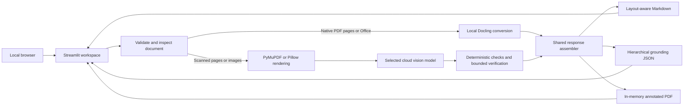

# Paperplane

[](https://github.com/pypi-ahmad/Agentic-Document-Extraction/actions/workflows/ci.yml)
[](https://github.com/pypi-ahmad/Agentic-Document-Extraction/releases/latest)
[](https://www.python.org/)
[](https://streamlit.io/)
[](LICENSE)

**A local, stateless Streamlit workspace that converts PDFs, images, and modern Office
documents into layout-aware Markdown, hierarchical grounding JSON, and annotated evidence
PDFs.**

**GitHub:** [pypi-ahmad/Agentic-Document-Extraction](https://github.com/pypi-ahmad/Agentic-Document-Extraction)

Paperplane 4.2.1 is inspired by LandingAI ADE's observable document-output workflow. It is
an independent implementation built around local Docling conversion and selectable cloud
vision models; it does not call LandingAI services or claim ADE model or benchmark parity.

## Features

- Automatically routes text-native PDF pages to local Docling and scanned pages to the
  selected cloud vision model.
- Preserves reading order and document structure, including headings, lists, checkboxes,
  forms, figures, charts, marginalia, and HTML tables with merged-cell metadata.
- Produces validated document → page → block → atomic-line/table-cell JSON with exact
  Unicode Markdown ranges and normalized source boxes.
- Displays rendered output, an annotated evidence PDF, raw Markdown, and JSON in the UI.
- Downloads Markdown, JSON, and annotated PDF artifacts directly from the current session.
- Offers Fast, Balanced, and Audit processing modes with bounded verification budgets.
- Supports six configured cloud models across OpenAI, xAI, Google, Anthropic, and Agnes.
- Aggregates provider-reported token usage and estimates model cost in the UI.
- Keeps uploaded documents and results in Streamlit session memory without a database,
  queue, API server, or durable application store.
- Includes one-file Windows setup and launch through `Paperplane.cmd`.

## Demo

> [!NOTE]
> A screenshot has not yet been committed. Launch Paperplane locally and open
> [http://127.0.0.1:8551](http://127.0.0.1:8551) to view the current interface.

The workspace provides a source preview beside the parse controls, followed by result
metrics, cost details, four inspection tabs, and three artifact downloads.

## Supported inputs

| Input | Processing path | Cloud key required? |
|---|---|---|
| Text-native PDF pages | Local Docling | No, unless figures need descriptions |
| Scanned PDF pages | Selected cloud vision model | Yes |
| Mixed PDFs | Automatic page-by-page Docling/vision routing | Yes for scanned pages |
| PNG, JPEG, WebP, TIFF, BMP | Selected cloud vision model | Yes |
| DOCX, PPTX, XLSX, ODT, ODP, ODS, CSV | Local Docling | Optional for figure descriptions |

Encrypted or password-protected PDFs and legacy DOC, PPT, and XLS files are not supported.

## Outputs

| Output | Description |
|---|---|
| Rendered output | Sanitized, readable rendering of the generated Markdown |
| Annotated PDF | Source overlays for grounded PDF/image blocks or a semantic evidence report for Office content without reliable coordinates |
| Markdown | Reading-order Markdown with explicit page breaks and layout-derived structure |
| JSON | Metadata plus document, page, block, atomic-line, table-cell, range, and grounding data |

Physical pages are one-based. Boxes use normalized top-left-origin coordinates, and
Markdown ranges use half-open Unicode code-point offsets. Public IDs are stable within one
response, not across independent re-parses.

## Tech stack

| Area | Technology |
|---|---|
| Application and UI | Python 3.12, Streamlit |
| Native document conversion | Docling and Docling Core |
| PDF and image processing | PyMuPDF and Pillow |
| Data contracts | Pydantic |
| Provider integrations | HTTPX with provider-native structured-output APIs |
| Safe rendered output | Bleach allowlist sanitization |
| Environment and locking | uv, `pyproject.toml`, `uv.lock` |
| Quality tooling | Pytest, Ruff, Pyright, GitHub Actions |

Paperplane does not require Node.js, npm, Docker, a GPU, a database, a local model server,
or Visual Studio C++ build tools.

## Project structure

```text
Agentic-Document-Extraction/
├── streamlit_app.py             # Streamlit UI, session state, previews, and downloads
├── Paperplane.cmd               # One-file Windows setup and launcher
├── paperplane/
│   ├── runtime.py               # In-process parser and provider-client composition
│   ├── parser.py                # Validation, routing, merging, and response assembly
│   ├── ingest.py                # File checks, PDF inspection, and page rendering
│   ├── docling_parser.py        # Local PDF and Office conversion
│   ├── pipeline.py              # Vision drafts, reconciliation, and crop verification
│   ├── model_catalog.py         # Supported models, credentials, and cost rates
│   ├── openai_document.py       # OpenAI and xAI Responses adapter
│   ├── gemini_document.py       # Google Gemini generateContent adapter
│   ├── anthropic_document.py    # Anthropic Messages adapter
│   ├── agnes_document.py        # Agnes Chat Completions adapter
│   ├── contracts.py             # Markdown and hierarchical grounding contracts
│   ├── grounding.py             # Coordinate transforms and native-text alignment
│   └── annotated_pdf.py         # Source overlays and semantic evidence reports
├── tests/                       # Unit, contract, routing, artifact, and AppTest coverage
├── docs/                        # Setup, architecture, models, quality, and operations
├── scripts/                     # Documentation and release automation
├── Sample-PDF/                  # Example input document
├── .streamlit/config.toml       # Local server and theme configuration
├── .env.example                 # Portable credential template
├── pyproject.toml               # Dependencies and tool configuration
└── uv.lock                      # Reproducible dependency lockfile
```

## Setup

### Requirements

- Windows 11 for the one-click launcher.
- Internet access for the first dependency and Docling model download.
- A provider key only when processing scans, images, or optional figure descriptions.

The manual developer workflow uses Python 3.12.10 and uv. GitHub Actions also verifies the
application on Linux, but the supported end-user launcher is Windows-focused.

### 1. Get the project

Clone the repository:

```powershell
git clone https://github.com/pypi-ahmad/Agentic-Document-Extraction.git
cd Agentic-Document-Extraction
```

You can also download a source archive from the
[latest GitHub release](https://github.com/pypi-ahmad/Agentic-Document-Extraction/releases/latest).

### 2. Configure a provider when needed

The selected provider's key is required for scanned PDFs and image files. Native text PDFs
and supported Office/OpenDocument files can be converted locally without a provider key.

For Windows, store credentials in the current user's environment and open a new terminal:

```powershell
[Environment]::SetEnvironmentVariable("OPENAI_API_KEY", "your-key", "User")
[Environment]::SetEnvironmentVariable("OPENAI_BASE_URL", "https://api.openai.com", "User")
```

Set only the key for the provider you intend to use. The complete mapping is listed under
[Environment variables](#environment-variables).

### 3. Launch on Windows

Double-click `Paperplane.cmd`. On first launch it:

1. installs uv when necessary;
2. installs Python 3.12.10;
3. synchronizes the exact dependencies in `uv.lock`;
4. downloads the required Docling layout and table models; and
5. starts Streamlit at [http://127.0.0.1:8551](http://127.0.0.1:8551).

Close the launcher window or press Ctrl+C to stop the application.

### Manual setup

For development or terminal-based startup:

```powershell
uv python install 3.12.10
uv sync --locked
uv run docling-tools models download layout tableformer --quiet
uv run --locked streamlit run streamlit_app.py --server.port=8551
```

## Environment variables

| Variable | Used by | Required when |
|---|---|---|
| `OPENAI_API_KEY` | GPT-5.6 Luna | The selected model handles scans, images, or figures |
| `OPENAI_BASE_URL` | OpenAI Responses API | Optional OpenAI-only endpoint override; defaults to `https://api.openai.com` |
| `XAI_API_KEY` | Grok 4.6 | Grok handles scans, images, or figures |
| `GEMINI_API_KEY` | Gemini 3.5 Flash-Lite and Gemini 3.6 Flash | Either Gemini model handles scans, images, or figures |
| `ANTHROPIC_API_KEY` | Claude Sonnet 5 | Claude handles scans, images, or figures |
| `AGNES_API_KEY` | Agnes 2.5 Flash | Agnes handles scans, images, or figures |

Configuration is resolved in this order:

1. existing process or Windows user environment variables;
2. an ignored `.env` copied from `.env.example`;
3. an ignored `.streamlit/secrets.toml` copied from its example; and
4. built-in provider base URLs.

Portable local fallbacks:

```powershell
Copy-Item .env.example .env
# or
Copy-Item .streamlit/secrets.toml.example .streamlit/secrets.toml
```

Never commit either local file or a real API key. `OPENAI_BASE_URL` affects only OpenAI;
the other provider endpoints are fixed by their adapters.

## Usage

1. Start Paperplane and open `http://127.0.0.1:8551`.
2. Select one of the six configured AI models. GPT-5.6 Luna is the default.
3. Select Fast, Balanced, or Audit mode.
4. Upload one supported document.
5. Choose **Parse document**.
6. Review the page, block, engine, duration, token, warning, and estimated-cost summaries.
7. Inspect the **Output**, **Annotated PDF**, **Markdown**, and **JSON** tabs.
8. Download the Markdown, annotated PDF, or JSON artifact.
9. Choose **New extraction** to clear the current workspace.

An example document is included at
[`Sample-PDF/PublicWaterMassMailing.pdf`](Sample-PDF/PublicWaterMassMailing.pdf). Upload it
through the UI to exercise the PDF workflow.

## How it works



1. The parser validates file type, integrity, byte size, page count, PDF canvas area, and
   decoded image pixels.
2. Each PDF page is classified independently. Native pages use Docling; scan-like pages
   are rendered and sent to the selected vision provider.
3. Docling handles supported Office, OpenDocument, and CSV files locally. Figure crops may
   use the selected provider when its key is available.
4. Vision output passes through deterministic normalization, native-word alignment,
   duplicate suppression, quality checks, and mode-bounded reconciliation.
5. Both engines feed one Pydantic-validated assembler that builds reading-order Markdown,
   global ranges, stable response-local IDs, and hierarchical grounding.
6. Paperplane aggregates provider usage, estimates cost, builds the evidence PDF, and
   stores the latest result only in the current Streamlit session.

## Models and processing modes

Paperplane exposes exactly these configured vision models:

- Grok 4.6 (`grok-4.6`)
- GPT-5.6 Luna (`gpt-5.6-luna`, default)
- Gemini 3.5 Flash-Lite (`gemini-3.5-flash-lite`)
- Gemini 3.6 Flash (`gemini-3.6-flash`)
- Claude Sonnet 5 (`claude-sonnet-5`)
- Agnes 2.5 Flash (`agnes-2.5-flash`)

The selected model is used for the initial vision draft and any permitted verification
calls. The processing mode changes the rendering and verification budget, not the provider
model.

| UI mode | Internal mode ID | Behavior |
|---|---|---|
| Fast | `paperplane-ade-fast-latest` | One draft with deterministic grounding; no verification pass |
| Balanced | `paperplane-ade-latest` | Reconciles or crop-verifies content flagged by deterministic checks |
| Audit | `paperplane-ade-audit-latest` | Uses the highest rendering, reconciliation, and repair budget |

See the [model catalog](docs/MODELS.md) for configured prices, cost-estimation rules, and
provider documentation. Displayed costs are estimates; provider invoices are authoritative.

## Configuration and limits

The checked-in [Streamlit configuration](.streamlit/config.toml) uses these defaults:

| Setting | Default |
|---|---|
| Address | `127.0.0.1` |
| Port | `8551` |
| Maximum upload | 200 MB |
| XSRF protection | Enabled |
| Streamlit usage telemetry | Disabled |
| Theme | Dark |

Parser safety limits:

- 500 pages or image frames per document;
- 4,000,000 source-coordinate units of PDF canvas area per page; and
- 40,000,000 decoded pixels across all image frames.

Processing is synchronous, and vision pages are processed sequentially. A provider request
uses a 180-second client timeout.

## Data handling and limitations

- Uploads, provider responses, generated Markdown/JSON, and annotated PDFs remain in the
  current Streamlit session unless explicitly downloaded.
- Closing the tab, selecting another file, choosing **New extraction**, or stopping the app
  releases that session state.
- Installed dependencies and Docling model weights remain on disk; document statelessness
  does not apply to runtime resources.
- Scanned pages, images, and requested figure crops are sent to the selected provider
  endpoint. Review the provider's privacy terms before processing sensitive material.
- Model-produced HTML is sanitized before Streamlit renders it.
- The included configuration is local and single-user. Do not expose the Streamlit port to
  an untrusted network.
- There is no REST API, database, background queue, batch endpoint, cancellation, resume,
  saved history, schema extraction, Docker image, or hosted deployment profile.
- Extraction quality depends on the document and selected model. Always verify high-impact
  financial, legal, medical, safety, or compliance data against the source evidence.

## Development

Install development, test, lint, and documentation dependencies:

```powershell
uv sync --locked --extra test --extra lint --extra docs
```

Run the repository checks:

```powershell
uv run ruff check paperplane tests streamlit_app.py scripts
uv run ruff format --check paperplane tests streamlit_app.py scripts
uv run pyright
uv run pytest tests -q
```

The CI workflow performs locked installation, linting, formatting checks, type checking,
tests with coverage, documentation generation, and a Streamlit startup smoke test.

## Documentation

- [Run guide](docs/RUN_APP.md)
- [Setup guide](docs/SETUP.md)
- [Architecture](docs/ARCHITECTURE.md)
- [How the pipeline works](docs/how-it-works.md)
- [Model catalog and pricing](docs/MODELS.md)
- [Capabilities](docs/APP_CAPABILITIES.md)
- [Quality and verification](docs/QUALITY.md)
- [Known limitations](docs/LIMITATIONS.md)
- [Contributor onboarding](ONBOARDING.md)
- [Contributing](CONTRIBUTING.md)
- [Security policy](SECURITY.md)
- [Changelog](CHANGELOG.md)
- [GitHub Issues](https://github.com/pypi-ahmad/Agentic-Document-Extraction/issues)
- [GitHub Releases](https://github.com/pypi-ahmad/Agentic-Document-Extraction/releases)

## License

Paperplane is available under the [MIT License](LICENSE).

## Acknowledgements

Paperplane builds on [Streamlit](https://streamlit.io/),
[Docling](https://github.com/docling-project/docling),
[PyMuPDF](https://pymupdf.readthedocs.io/), and provider-native multimodal APIs. Its
document-output workflow is inspired by LandingAI ADE while remaining a separate,
independent implementation.
