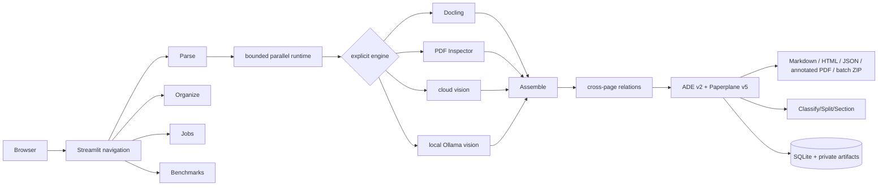

# Architecture

Paperplane 5.1.0 runs as one local Streamlit process with a framework-neutral Python
package. It has no JavaScript frontend or public HTTP API. SQLite stores local job metadata;
private inputs and artifacts live in `%LOCALAPPDATA%\Paperplane` and expire after seven
days.

## Boundaries

- `workspace_app.py` owns navigation; `streamlit_app.py` is the Parse page.
- `runtime.py` composes providers and processes files concurrently; files never share
  context.
- `agnes_document.py` sends selected page PNGs inline in Agnes Chat Completions requests;
  it does not publish uploads at separate URLs.
- `parser.py` applies page ranges and allows only previous selected pages to inform later
  page processing.
- `contracts.py` is the internal grounded representation; `ade_contracts.py` produces
  strict zero-based ADE v2-style JSON and the namespaced Paperplane export.
- `ade_workflows.py` implements cited Classify, Split, and Section organization workflows.
- `jobs.py` is a future-HTTP-wrappable service boundary for durable lifecycle, checkpoints,
  retention, and deletion.
- `document_intelligence.py`, `calibration.py`, and `benchmark.py` keep semantic relations,
  confidence, and evaluation explicit and independently testable.
- `outputs.py` converts model-produced Markdown to allowlist-sanitized standalone HTML and
  builds traversal-safe, manifest-versioned batch archives without source uploads.

Block and line grounding is the ADE-compatible interoperability boundary. Observed word
grounding, provenance, confidence status, and cross-page relations are Paperplane
extensions. IDs are stable only within one response.
