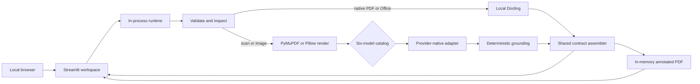

# Architecture

Paperplane 4.1.0 is one local Streamlit process. The UI calls a framework-neutral Python
parser directly; there is no API server, database, worker, queue, JavaScript frontend, or
server-side artifact store.

## Component boundaries

| Component | Responsibility |
|---|---|
| `streamlit_app.py` | Widgets, preview, session state, result views, and downloads |
| `paperplane/runtime.py` | Cached Docling resources and short-lived provider HTTP client |
| `paperplane/model_catalog.py` | Fixed model names, API IDs, providers, and credential names |
| `paperplane/agnes_document.py` | Agnes 2.5 Flash Chat Completions boundary |
| `paperplane/openai_document.py` | OpenAI and xAI Responses boundary |
| `paperplane/gemini_document.py` | Google Gemini `generateContent` boundary |
| `paperplane/anthropic_document.py` | Anthropic Messages boundary |
| `paperplane/ingest.py` | Type, integrity, size, page, canvas, pixel, and routing checks |
| `paperplane/parser.py` | Per-document orchestration and engine merge |
| `paperplane/docling_parser.py` | Local native-document structure and table conversion |
| `paperplane/pipeline.py` | Vision draft, reconciliation, crop verification, and fallback |
| `paperplane/grounding.py` | Coordinate transforms and native-word alignment |
| `paperplane/contracts.py` | Markdown assembly and hierarchical grounding validation |
| `paperplane/annotated_pdf.py` | Source overlays and semantic-only evidence reports |

## Parse lifecycle

1. Streamlit accepts one supported document, one AI model, and one processing mode.
2. The parser validates bytes and classifies each PDF page as native or scan-like.
3. Docling handles native content; the selected catalog model handles scans and images.
4. Mixed-engine pages are merged by original one-based page number.
5. The assembler produces one validated `ParseResponse` containing Markdown, structure,
   metadata, provider token usage, ranges, and grounding.
6. The evidence builder overlays physical boxes or emits a semantic-only Office report.
7. Streamlit estimates model cost from the reported tokens and configured catalog rates,
   displays the result, and exposes three downloads.
8. The provider client closes; document state remains only in the current Streamlit session.

## Grounding model

Physical source boxes are normalized to the page with a top-left origin. Markdown ranges
are half-open Unicode code-point offsets, so `markdown[start:end]` reproduces the grounded
text. Office content without reliable physical geometry uses `semantic_only` with a null
box. IDs are stable within one response, not across independent re-parses.

## State and configuration

The cached Docling converter contains model resources only. Uploads, model responses,
annotated PDFs, and final results are never placed in a persistent application cache.

Configuration resolves in this order: existing process/user environment, ignored `.env`,
ignored Streamlit secrets, then the built-in provider base URLs. Each model's credential
name is defined in the [model catalog](MODELS.md); `OPENAI_BASE_URL` is an optional
OpenAI-only override. Streamlit binds to
`127.0.0.1`, enables XSRF protection, and sanitizes model-produced Markdown before rendering
supported HTML.
