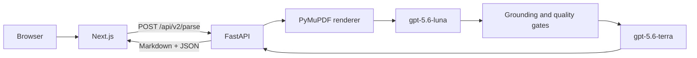

# Architecture

Paperplane has two processes and one external model provider. It has no application
database, worker service, or server-side artifact store.

## Request lifecycle

1. `backend/app/routers/dpt_api.py` validates and reads the upload with a size limit.
2. `AgenticDocumentParser` validates the document and renders its pages.
3. `V2PageProcessor` creates a structured Luna draft, grounds it to page geometry, and
   uses bounded Terra verification according to the selected mode.
4. The parser assembles one `ParseResponse` with Markdown, hierarchical structure,
   grounding, warnings, and usage metadata.
5. FastAPI returns the response directly; the browser renders it locally.

## Boundaries

- FastAPI owns one shared HTTP client and parser for its process lifetime.
- Each parse request owns its upload bytes, rendered pages, intermediate results, and final
  response. They become unreachable after the response completes.
- The frontend keeps only the selected local file URL and the latest response in React state.
- OpenAI credentials never enter browser code.
- Optional `API_KEY` authentication and per-identity throttling protect `/v2/*`.

The public contract is `backend/app/services/agentic/contracts.py`. Page and block
coordinates remain connected to the Markdown and JSON output, enabling visual review
without retaining a server-side copy of the source document.

For a visual map, open [paperplane-system.html](architecture/paperplane-system.html).
