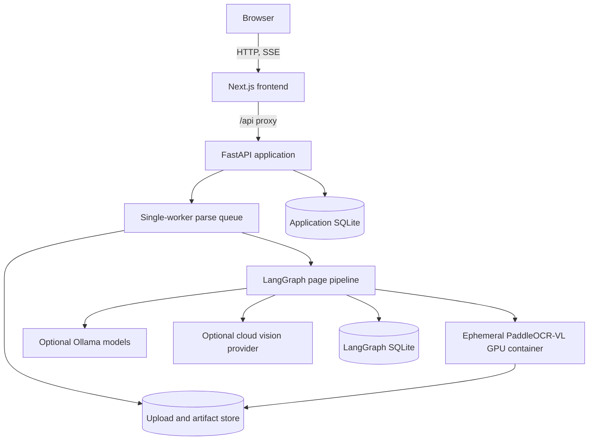
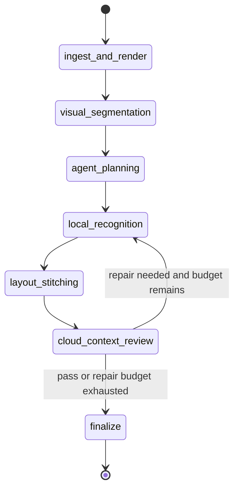

# Paperplane architecture

This document is the canonical technical design for Paperplane v1.0. It describes the
current implementation and its invariants. For a conceptual walkthrough, read
[How Paperplane works](how-it-works.md).

## Design goals

Paperplane converts visually complex documents into auditable Markdown and structured
evidence. The design optimizes for:

- layout and reading order before plain text;
- page- and region-level provenance for every accepted block;
- bounded, observable model decisions rather than an open-ended agent loop;
- durable recovery across long GPU jobs;
- local-first processing with explicit cloud escalation;
- useful partial results when individual pages or optional artifacts fail.

It is deliberately a single-workstation system. The in-process queue admits one document
at a time, the default document limit is 500 pages, and SQLite is the authoritative
metadata store. Authentication and multi-tenant isolation are outside the current design.

## Runtime topology



### Frontend

`frontend/src/app/page.tsx` owns upload, settings, job selection, progress, and artifact
presentation. `DocumentInspector` synchronizes the document tree, page image, region
overlay, Markdown, recognition candidates, and quality report. The browser calls relative
`/api/*` URLs; `frontend/next.config.js` proxies them to `PAPERPLANE_BACKEND_ORIGIN`.

API keys are never collected by or returned to the browser. The runtime-capability API
returns provider readiness and allowed model names only.

### FastAPI application

`backend/app/main.py` creates application-scoped resources during its lifespan:

1. configure structured logging and optional telemetry;
2. validate the Ollama URL and run database migrations;
3. create storage directories;
4. start `ParserRuntime`, including HTTP clients and the LangGraph checkpointer;
5. start and recover the parse queue;
6. drain or pause work during shutdown.

Routers cover parse jobs, batches, inspection, reprocessing, review cases, curation,
evaluation runs, extraction schemas, Ollama discovery, and runtime capabilities. Setting
`API_KEY` applies `X-API-Key` authentication to protected `/api/*` routes.

### Parser runtime

`ParserRuntime` owns one shared `httpx` client for Ollama, one cloud client, the dynamic
Ollama catalog, the cloud provider registry, the layout parser, the Paddle Docker runner,
and the compiled LangGraph. Expensive resources therefore live for one FastAPI lifespan,
not one request.

### PaddleOCR-VL boundary

`PaddleOCRVLDockerRunner` launches the pinned official PaddleOCR-VL 1.6 image for each
document batch. Its security and reproducibility boundary is explicit:

- GPU device 0, an 8 GB shared-memory allocation, and a PID limit;
- all Linux capabilities dropped and `no-new-privileges` enabled;
- rendered pages mounted read-only;
- result, model-cache, and read-only worker-script mounts kept separate;
- job labels validated before cancellation;
- NDJSON progress validated before it reaches the application;
- result size, page coverage, dimensions, and block structure validated before import.

The container exits after its batch and releases VRAM before subsequent local or cloud
review. The backend never pulls an image implicitly. Readiness reports the exact pinned
pull command when the image is absent.

## End-to-end execution

### 1. Admission and durable job creation

`POST /api/parse-jobs` validates settings, provider/model compatibility, input type,
upload size, page count, and page range before persisting anything. It writes the source
file, creates one pending `PageCheckpoint` per selected page, commits the job, then submits
its ID to the queue. Batch admission performs the same validation atomically for all files.

### 2. Worker batching

The worker selects incomplete pages in consecutive groups of at most
`PARSE_BATCH_PAGES` (10 by default). A page checkpoint is the restart boundary. Completed
and fingerprint-valid pages are not reprocessed on resume or failed-page retry.

### 3. LangGraph batch pipeline

The worker invokes one graph run for the current page batch; nodes operate on every page in
that batch. The graph in `backend/app/services/extraction/graph.py` is the agentic core:



| Node | Contract |
|---|---|
| `ingest_and_render` | Render only the current pages and capture native PDF words with coordinates |
| `visual_segmentation` | Run PaddleOCR-VL and normalize its block types, order, content, and geometry |
| `agent_planning` | Resolve the quality policy and create a page-specific processing plan |
| `local_recognition` | Run configured recognition only for scanned, targeted, or blind-retry regions |
| `layout_stitching` | Build hierarchy, relationships, crops, Markdown, chunks, and coordinate verification |
| `cloud_context_review` | Review flagged or all pages according to mode and produce bounded repair issues |
| `finalize` | End the page graph with explicit warnings if unresolved issues remain |

`reflection_router` is the only cycle. It returns to local recognition only when repair is
needed and `repair_count < max_repairs`. `max_repairs` is a finite validated setting, and
every traversal caused by incoming repair issues increments `repair_count` before returning
to review. Therefore the cycle can run at most `max_repairs` times. The initial scanned-page
recognition pass is not a repair traversal and does not consume that budget.

### 4. Commit and document assembly

After each successful page, the worker writes page layout and diagnostics, updates its
fingerprint, and commits its database checkpoint before starting the next batch. Once no
more pages can run, document-wide assembly reconstructs hierarchy across page boundaries,
removes repeated marginalia according to policy, segments mixed files, performs requested
schema extraction, and materializes artifacts.

Failures in optional artifacts become warnings. A page failure remains visible in job
state and in partial Markdown/JSON. The annotated PDF is always attempted and is required
for `verified_export_ready`, but its failure is not a terminal job failure: the job completes
with warnings so other usable output remains accessible.

## Model responsibilities

### PaddleOCR-VL 1.6

PaddleOCR-VL is the primary document parser. It supplies structured regions for text,
headings, tables, formulas, figures, charts, seals, and other page elements, including
reading order and geometry. Native PDF words may enrich recognized text, but Paddle's
visual geometry remains authoritative for mixed layouts.

### Recognition stage

The selected OCR provider/model is a second recognition stage, not the layout engine.
The graph node is named `local_recognition` for historical reasons, but the selected OCR
provider may be Ollama or a configured cloud provider. For scanned pages, local GLM-OCR can
run across Paddle regions even when the initial parse did not raise an error. Later passes
are targeted to failed or disputed regions. Candidate outputs retain source, model, attempt,
verdict, confidence, latency, and warnings.

### Context review

The graph node is named `cloud_context_review`, but its reviewer can be a distinct Ollama
model or a configured OpenAI, Anthropic, Gemini, or xAI model. Setting `cloud_mode=off`
disables the node's model call. Adaptive review checks flagged pages; all-page review checks
every selected page. Processing-mode presets populate these settings in the UI. A remote
provider failure is a warning when local output is still usable.

When cloud review disagrees and blind retry is enabled, the graph sends the original crop
to local recognition again. It does not include the cloud answer, preventing the second
local observation from merely echoing the reviewer.

Recognition-provider choice is independent of review mode: choosing a cloud OCR provider
can send targeted crops remotely even when the context reviewer is off. `local_only` keeps
both roles on local infrastructure; hybrid and maximum-accuracy presets enable cloud review
according to their policies.

### Candidate selection

Paddle or native content begins as the current region value. When the recognition stage
runs, `VisionZoneEngine` retains that value as an unselected candidate, appends the new
model output, and deterministically marks the newest attempt selected. Text similarity
below 0.6 adds a `recognition_disagreement` warning; it does not silently choose the older
text. Review may trigger another attempt, which becomes the newest candidate. Explicit page
or region reprocessing adds a separate quality gate that can restore the backed-up result
when the new page does not meet or improve the stored score and status.

## Core data contracts

### Regions and coordinates

A `Region` carries a stable page-scoped ID, semantic type, content, source, confidence,
reading order, normalized bounding box, optional parent and related IDs, table cells,
recognition candidates, and warnings. Coordinates are normalized during parsing and are
converted to image pixels or PDF points only at rendering/export boundaries.

Stable IDs connect every representation:

```text
source page -> region -> candidate -> Markdown block -> context chunk
            -> schema value citation -> overlay box -> review case
```

Grounded Markdown uses readable HTML comments such as
`<!-- region: p0001-r0002 type=text bbox=... source=... -->`. LLM Markdown uses a JSON
`paperplane-citation` comment per block and a `paperplane-table-citations` manifest for
cells. Clean Markdown intentionally omits these comments. Schema values may cite multiple
regions or cells; their grounding value is therefore a list, not a single pointer.

### Layout and Markdown

`DocumentLayout` contains ordered `PageLayout` objects. Stitching preserves Paddle order
when supplied, infers lightweight columns and spanning blocks, associates nearby captions,
tracks a heading stack, and emits:

- clean hierarchical Markdown;
- grounded Markdown with page, region, and bounding-box anchors;
- LLM Markdown with explicit citations;
- ordered context chunks with heading paths and parent relationships;
- canonical structured blocks and table cells.

### Quality evidence

Deterministic checks cover empty regions, malformed tables, low confidence, excessive
overlap, coordinate validity, OCR coverage, candidate disagreements, citation coverage,
and table integrity. A reviewer can add visual verdicts and page-level scores. The quality
report distinguishes measured integrity from labeled evaluation accuracy; it does not
invent an accuracy percentage when no ground truth exists.

## Persistence model

Paperplane intentionally separates four kinds of state:

| Store | Authority |
|---|---|
| Application SQLite | Jobs, pages, artifacts, batches, schemas, evaluation, review cases, and reprocessing runs |
| LangGraph SQLite | Node-level execution checkpoints for resumable graph execution |
| Upload directory | Original source bytes and per-job work files |
| Artifact directory | Durable Markdown, JSON, PDFs, crops, manifests, and ZIP bundles |

`ParserState` contains serializable paths and typed JSON, not image bytes. This keeps
checkpoints smaller and lets artifact retention be managed independently.

Canonical page layout JSON is written under
`jobs/{job_id}/checkpoints/p{page_number}/layout.json`; diagnostics live beside it. The
database checkpoint stores those paths, the layout SHA-256, and the diagnostic fingerprint.
The worker writes files first and commits their paths and completed status together. A crash
before the database commit can leave orphan files, but they are ignored because the page is
not durably completed. Startup changes formerly active jobs to `paused` with a restart
reason, requeues jobs that were already `queued`, and requires the operator to resume paused
jobs. Resume reuses only completed checkpoints whose referenced layout still validates;
otherwise the page is processed again. LangGraph checkpoints help resume node execution but
never override the application page checkpoint.

## Inspection and reprocessing

Inspection endpoints read durable page layouts rather than transient process memory. The
UI can therefore reopen historical jobs, search the document tree, display precise boxes,
and inspect which candidate the agent selected.

Page reprocessing marks only the selected checkpoint pending and reruns it at the requested
DPI. Region reprocessing crops the existing region with bounded padding. Before either
operation, the service stores the prior layout and diagnostics. The automatic decision
gate applies a new candidate when it meets or improves the stored quality score and does
not reduce the stored quality-status rank; there is no manual
candidate override.

## Schema extraction and evaluation

Reusable extraction schemas support a restricted JSON Schema Draft 2020-12 object subset.
The selected schema and hash are snapshotted onto the job so later schema edits cannot
change historical meaning. Deterministic block and table matching runs first; configured
models resolve only missing or conflicting fields. Accepted non-empty values cite canonical
region or table-cell IDs.

Evaluation runs compare completed output with grounded labels. Metrics cover Markdown,
regions, text, hierarchy, reading order, citations, bounding boxes, and tables. Evaluation
does not alter production output; review and curation records capture failure cases for
later analysis.

## Failure and shutdown semantics

- Admission failure creates no partial job.
- A failed GPU batch is retried up to `PARSE_BATCH_MAX_ATTEMPTS`.
- Successful pages survive later page or batch failure.
- Cancellation stops only a container whose job label matches the requested job.
- Shutdown allows the active job a grace period, then leaves it recoverable.
- Provider errors never expose credentials or raw authorization headers.
- Optional artifact failures become warnings and remain visible in the bundle manifest.

## Extension rules

- Add a vision provider behind `VisionProviderRegistry`; keep credentials server-side and
  return only catalog metadata to the UI.
- Add graph behavior as a typed node with explicit state inputs and outputs. Any loop must
  have a persisted counter and a hard limit.
- Add artifact types through the existing artifact service so hashes, MIME types, preview
  policy, and bundle inclusion stay consistent.
- Add extraction behavior against canonical block IDs rather than reparsing raw Markdown.
- Preserve page checkpoints and stable region IDs across compatible changes.

## Architectural limits

Paperplane does not provide distributed scheduling, horizontal workers, object-store
leases, user accounts, tenant isolation, or transactional multi-host coordination. Scaling
to millions of pages would require replacing the in-process queue and local filesystem,
introducing external coordination and object storage, and revisiting model-capacity and
security boundaries.
