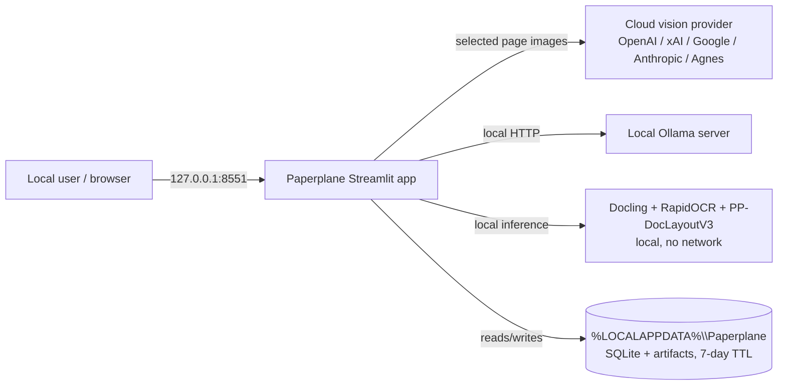
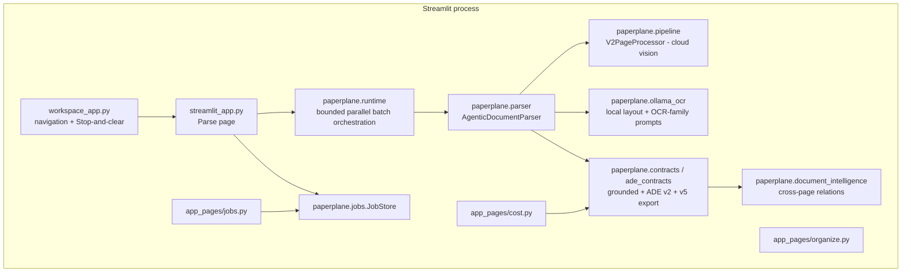
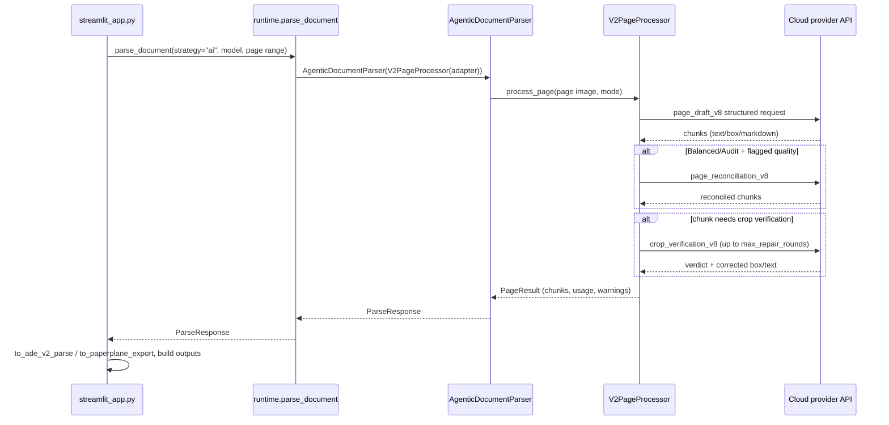
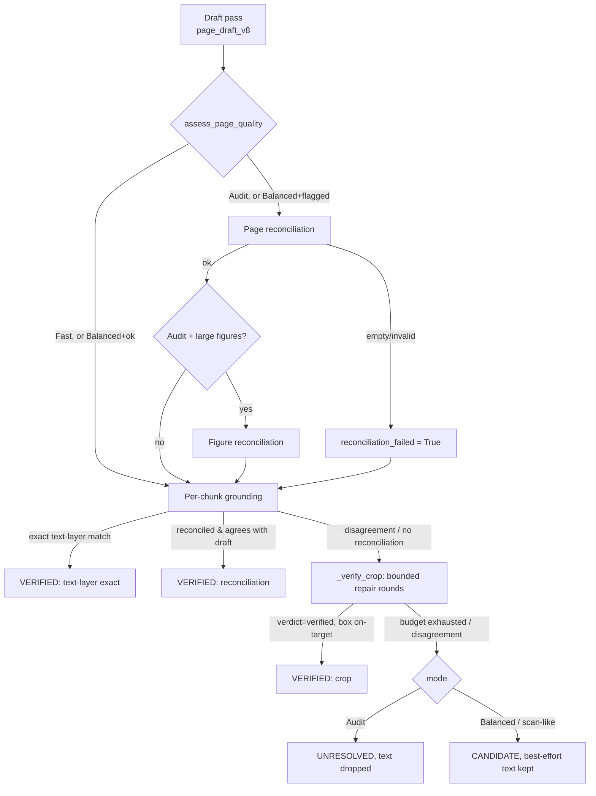

# Paperplane — Codebase Deep Dive

This document is a definitive, cited technical map of the Paperplane repository as checked
out locally. It complements the short [`docs/ARCHITECTURE.md`](ARCHITECTURE.md) overview
with verified detail: exact commands, deployment surface, subsystem internals, and an
honest confidence rating per claim area. Every non-obvious claim below cites a real file
path (relative to the repository root); paths with a line number were opened and read at
that line.

**Snapshot identity**

| Field | Value |
|---|---|
| Remote | `https://github.com/pypi-ahmad/Agentic-Document-Extraction.git` |
| Branch | `main` |
| HEAD commit | `908445214340177cef5c808663d496bc8adfaf5a` (2026-08-15 20:39:34 +0530) |
| Version | `5.3.0` ([`pyproject.toml:3`](../pyproject.toml)) |

This is a Windows checkout. CI workflow files and `Paperplane.sh` were read as text below,
not executed — their Linux/CI-runner behavior is reported from source, not from a live run.

---

## Part 1 — Whole-repo technical deep-dive

### What the repository is

Paperplane is a local, database-free Streamlit application that turns PDFs, images, and
Office documents into layout-aware Markdown, an annotated PDF, and two flavors of grounded
JSON (a strict ADE v2-style export and a richer `paperplane.parse.v5` export), using either
fully local processing (Docling, PDF Inspector, or a local Ollama vision model) or one
explicitly selected cloud multimodal provider ([`README.md:9-18`](../README.md)). It has no
server-side database, no public HTTP API, and no multi-user auth; job metadata and private
artifacts are retained locally under `%LOCALAPPDATA%\Paperplane` for seven days
([`docs/ARCHITECTURE.md:4-6`](ARCHITECTURE.md)).

### Tech-stack detection table

| Layer | Technology | Evidence |
|---|---|---|
| Language / runtime | Python `>=3.12,<3.13` | [`pyproject.toml:11`](../pyproject.toml) |
| UI framework | Streamlit `[pdf]>=1.61.1,<2` | [`pyproject.toml:24`](../pyproject.toml) |
| Data contracts | Pydantic `>=2.0,<3.0` | [`pyproject.toml:25`](../pyproject.toml) |
| HTTP client | HTTPX `>=0.27.0` | [`pyproject.toml:26`](../pyproject.toml) |
| PDF handling | PyMuPDF `>=1.28,<2` | [`pyproject.toml:29`](../pyproject.toml) |
| Imaging | Pillow `>=12.3.0,<13` | [`pyproject.toml:30`](../pyproject.toml) |
| Local ML | Transformers `>=5.3.1,<6`, Torch `>=2.11` (cpu/cu130 index groups) | [`pyproject.toml:31`](../pyproject.toml), [`pyproject.toml:47-51`](../pyproject.toml) |
| Local document parsing | Docling `[rapidocr]>=2.66,<3` | [`pyproject.toml:32`](../pyproject.toml) |
| Local PDF inspection | `pdf-inspector>=1.14.2,<2` | [`pyproject.toml:33`](../pyproject.toml) |
| HTML sanitization | Bleach `>=6,<7` | [`pyproject.toml:34`](../pyproject.toml) |
| Markdown rendering | `Markdown>=3.7,<4` | [`pyproject.toml:35`](../pyproject.toml) |
| Local metadata store | SQLite (stdlib `sqlite3`) | [`paperplane/jobs.py:7`](../paperplane/jobs.py) |
| Test runner | Pytest `>=8.0` + pytest-asyncio + pytest-cov | [`pyproject.toml:39-43`](../pyproject.toml) |
| Lint/format | Ruff `>=0.6.0` | [`pyproject.toml:45`](../pyproject.toml) |
| Type checker | Pyright `>=1.1.400`, `basic` mode | [`pyproject.toml:46`](../pyproject.toml), [`pyproject.toml:130-153`](../pyproject.toml) |
| Package manager | `uv` (`required-version >= 0.5.0`) | [`pyproject.toml:65-67`](../pyproject.toml) |

### Entry points

- **`workspace_app.py`** — the multipage entrypoint. Registers `st.navigation` with Parse
  (`streamlit_app.py`, default), Organize, Jobs, and Cost pages, and owns the global
  **Stop and clear** sidebar control that clears Streamlit caches/session state and
  schedules a process exit ([`workspace_app.py:13-32`](../workspace_app.py)).
- **`streamlit_app.py`** — the Parse page: engine toggles, quality mode, file upload,
  per-file page ranges, and the six output tabs (Input preview, Output, Annotated PDF,
  Markdown, HTML, JSON) ([`streamlit_app.py:1,53-71`](../streamlit_app.py)).
- **`app_pages/organize.py`, `app_pages/jobs.py`, `app_pages/cost.py`** — Organize
  (Classify/Split/Section), Jobs (durable local history), and Cost (session token ledger)
  pages, each a direct script per the project's page-organization convention
  ([`app_pages/`](../app_pages)).
- **`Paperplane.cmd`** / **`Paperplane.sh`** — one-file Windows/Linux setup-and-launch
  scripts; not Python entry points, but the canonical way most users start the app
  ([`Paperplane.cmd:1-15`](../Paperplane.cmd), [`Paperplane.sh:1-18`](../Paperplane.sh)).

### Commands & Verification Inventory

Sourced from [`.github/workflows/ci.yml`](../.github/workflows/ci.yml) and
[`CONTRIBUTING.md`](../CONTRIBUTING.md); all commands verified against the actual CI job.

| Command | Purpose | Evidence |
|---|---|---|
| `uv sync --locked --extra cpu --extra test --extra lint --extra docs` | Install locked deps | [`.github/workflows/ci.yml:37`](../.github/workflows/ci.yml) |
| `uv run --no-sync ruff check paperplane app_pages tests streamlit_app.py workspace_app.py scripts` | Lint | [`.github/workflows/ci.yml:40`](../.github/workflows/ci.yml) |
| `uv run --no-sync ruff format --check paperplane app_pages tests streamlit_app.py workspace_app.py scripts` | Format check | [`.github/workflows/ci.yml:43`](../.github/workflows/ci.yml) |
| `uv run --no-sync pyright` | Type check | [`.github/workflows/ci.yml:46`](../.github/workflows/ci.yml) |
| `uv run --no-sync pytest tests --cov=paperplane --cov-report=xml --cov-report=term-missing -q -p no:cacheprovider` | Test + coverage | [`.github/workflows/ci.yml:49-55`](../.github/workflows/ci.yml) |
| `uv run --no-sync python scripts/build_handbook.py` + `build_app_guide.py`, then `git diff --exit-code` on generated docs | Generated-doc drift check | [`.github/workflows/ci.yml:57-61`](../.github/workflows/ci.yml) |
| `uv run --no-sync python scripts/benchmark_report.py` | Validate locked benchmark corpus | [`.github/workflows/ci.yml:64`](../.github/workflows/ci.yml) |
| `streamlit run workspace_app.py --server.headless=true --server.address=127.0.0.1 --server.port=8551` + poll `/_stcore/health` | Smoke-test app boot | [`.github/workflows/ci.yml:66-80`](../.github/workflows/ci.yml) |
| `test -x Paperplane.sh && bash -n Paperplane.sh` | Validate Linux launcher syntax | [`.github/workflows/ci.yml:22-25`](../.github/workflows/ci.yml) |
| `pytest -k <name>` (single test) | Run one test | `[INFERRED]` — standard pytest, not spelled out in CI or CONTRIBUTING.md |

**CI workflows and triggers:**

| Workflow | Trigger | Purpose |
|---|---|---|
| `ci.yml` | push/PR to `main`, `workflow_dispatch` | The gate above | [`.github/workflows/ci.yml:3-8`](../.github/workflows/ci.yml) |
| `benchmarks.yml` | push to `main` touching `benchmarks/**`, `scripts/benchmark_report.py`, `paperplane/benchmark.py`; `workflow_dispatch` | Publishes benchmark transparency report to GitHub Pages | [`.github/workflows/benchmarks.yml:1-11`](../.github/workflows/benchmarks.yml) |
| `dependency-review.yml` | PR to `main` | Blocks on high-severity dependency advisories, comments on PR | [`.github/workflows/dependency-review.yml:1-22`](../.github/workflows/dependency-review.yml) |

**CI enforcement (required status checks / branch protection):** `[UNVERIFIED]` — branch
protection is a GitHub repository setting, not visible from the local checkout or workflow
YAML. Confirm in GitHub → Settings → Branches if this matters for planning.

### Directory layout

| Path | Purpose |
|---|---|
| `workspace_app.py` | Multipage Streamlit entrypoint and global Stop-and-clear control |
| `streamlit_app.py` | Parse page: engine selection, upload, processing, six output tabs |
| `app_pages/` | Organize, Jobs, Cost pages |
| `paperplane/` | Framework-neutral Python package — all parsing, contracts, and provider logic |
| `benchmarks/` | Locked corpus manifest (`manifest.json`) and transparency policy |
| `tests/` | 29 test modules, one per major `paperplane` component |
| `docs/` | Architecture, setup, engines, models, quality, limitations, runbook |
| `scripts/` | `benchmark_report.py`, `build_handbook.py`, `build_app_guide.py`, `handbook_pdf.py`, `release.py` |
| `Sample-PDF/` | Public example document used by the locked benchmark corpus |
| `Paperplane.cmd` / `Paperplane.sh` | Windows / Linux one-file setup-and-launch scripts |
| `.env.example` | Portable configuration template (placeholders only) |

### Deployment & Runtime Surface

Paperplane has **no container image, no Dockerfile, and no serverless runtime** — it is a
locally-run desktop-style app. The runtime surface instead consists of:

| Surface | Pin | Evidence |
|---|---|---|
| Python (build + run, same) | `3.12.10` | [`.github/workflows/ci.yml:30`](../.github/workflows/ci.yml), [`docs/SETUP.md:9`](SETUP.md) |
| CI runner image | `ubuntu-latest` (GitHub-hosted) | [`.github/workflows/ci.yml:16`](../.github/workflows/ci.yml) |
| `uv` version | `>=0.5.0` | [`pyproject.toml:66`](../pyproject.toml) |
| Torch CUDA index | `cu130` (CUDA 13.0) explicit index, `cpu` index alternative | [`pyproject.toml:53-63`](../pyproject.toml) |
| Local model-set version | `v1` (`PaddlePaddle/PP-DocLayoutV3_safetensors` pinned to a specific commit) | [`paperplane/model_store.py:15-17`](../paperplane/model_store.py) |

There is no build-vs-run drift risk here because there is no separate build artifact — the
same `uv sync --locked` environment both builds and runs the app on the developer's machine.
This is a deliberate architectural choice (local-first, no deployment pipeline), not a gap.

### EOL / dead-dependency scan

No EOL or abandoned dependencies were found. Every pinned major generation is current as of
this snapshot: Python 3.12 (supported), Streamlit 1.61+ (current major), Pydantic v2,
Transformers 5.x, Docling 2.x, Torch 2.11 with an explicit CUDA 13.0 index. `[INFERRED]` —
this assessment is based on version numbers only, not a live PyPI/EOL-database lookup (out
of scope per the local-first rule). One soft note: `GEMINI_API_KEY` is documented as a
"legacy fallback" behind `GOOGLE_API_KEY` ([`docs/MODELS.md:46-48`](MODELS.md)) — a naming
migration already in progress, not a dependency risk.

### Data/storage layers, APIs, background jobs, CI/CD, testing

- **Storage:** SQLite via stdlib `sqlite3` for job metadata (WAL mode), plus a filesystem
  artifact directory, both scoped under one `JobStore` root with a 7-day TTL
  ([`paperplane/jobs.py:37-46`](../paperplane/jobs.py)).
- **APIs:** No public HTTP API is exposed in this release
  ([`README.md:266-267`](../README.md)). Outbound HTTP calls go to six cloud model
  providers (OpenAI, xAI, Google, Anthropic, Agnes, and OpenAI-compatible) plus a local
  Ollama server, all through `httpx.AsyncClient` ([`paperplane/runtime.py:12,127`](../paperplane/runtime.py)).
- **Background jobs:** Execution happens inside the Streamlit process itself — there is no
  separate worker process or queue. `jobs.py` is explicitly noted as "a future-HTTP-wrappable
  service boundary" ([`docs/ARCHITECTURE.md:60-61`](ARCHITECTURE.md)), i.e. durable-looking
  but not yet decoupled from the UI process.
- **CI/CD:** see Commands & Verification Inventory above.
- **Testing:** 29 test modules under `tests/`, one per major subsystem (`test_pipeline.py`,
  `test_runtime.py`, `test_document_intelligence.py`, `test_reconciliation.py`,
  `test_ade_v5.py`, per-provider adapter tests, etc.) — a near 1:1 module-to-test-file
  mapping ([`tests/`](../tests)).

---

## Part 2 — Context & ecosystem

### Local checkout identity

| Field | Value |
|---|---|
| Remote | `https://github.com/pypi-ahmad/Agentic-Document-Extraction.git` |
| Branch | `main` |
| HEAD | `908445214340177cef5c808663d496bc8adfaf5a` |
| Version | `5.3.0` |
| License | MIT ([`LICENSE`](../LICENSE)) |

### Repo-specific agent/contributor docs

- **`CLAUDE.md`** (and identical `AGENTS.md`, `CODEBUDDY.md`, `QODER.md`) — the project
  contract: Paperplane is local and database-free; Docling handles native content; one
  AI model (selected in the UI) handles scans/images/figure descriptions; the supported
  catalog lives in `paperplane/model_catalog.py`; run on `127.0.0.1:8551`; update docs with
  every code change ([`CLAUDE.md`](../CLAUDE.md)). It also documents a project-local
  `code-review-graph` MCP tool convention for exploring the codebase.
- **`CONTRIBUTING.md`** — ground rules (one focused change per PR, conventional commits,
  never commit secrets/uploads, preserve the full model catalog, update docs in the same
  change) plus a manual smoke-test checklist for user-visible changes
  ([`CONTRIBUTING.md:11-54`](../CONTRIBUTING.md)).
- **`README.md`** — the single largest source of truth for features, supported
  inputs/outputs, environment variables, and setup; treated here as a claim set that was
  spot-verified against `pyproject.toml`, `docs/MODELS.md`, and CI, not restated blindly.

### Developer gotchas (cited)

- CI **rebuilds generated documentation** (`scripts/build_handbook.py`,
  `scripts/build_app_guide.py`) and fails the build on any diff — generated docs must be
  committed in sync with the code that produces them
  ([`.github/workflows/ci.yml:57-61`](../.github/workflows/ci.yml)).
- The Windows launcher actively **kills a previous Paperplane launcher tree** and anything
  bound to port 8551 before starting, to avoid `.venv` DLL locks during dependency repair
  ([`Paperplane.cmd:15`](../Paperplane.cmd)).
- `uv sync` for this project is **inexact** by design — the docs explicitly note that
  separately installed `test`/`lint`/`docs` extras are not removed by a plain sync
  ([`docs/SETUP.md:57-58`](SETUP.md)) — a deliberate tradeoff, not a bug.
- `pyproject.toml` declares mutually exclusive `cpu`/`cu130` extras via `[tool.uv] conflicts`
  ([`pyproject.toml:68-72`](../pyproject.toml)) — installing both is a resolver error, not a
  silent merge.

### Relationship to the wider ecosystem (as visible from disk)

Paperplane's contracts are explicitly modeled after **LandingAI ADE's** observable Parse
workflow and evidence model, but the project repeatedly and deliberately disclaims parity:
"It is an independent implementation: it does not call LandingAI, promise API drop-in
compatibility, or claim LandingAI accuracy parity" ([`README.md:16-18`](../README.md)). This
framing recurs in `docs/QUALITY.md`, `docs/LIMITATIONS.md`, and `DISCLAIMER.md` — it is a
consistent, intentional project stance rather than an oversight.

---

## Part 3 — Architectural blueprint

### System context (C4 Level 1)

### Containers (C4 Level 2)

### Representative request lifecycle (C4 Level 3) — one Cloud AI parse

### Layering and dependency rules

- **UI never talks to providers directly.** `streamlit_app.py` calls `paperplane.runtime`,
  which composes the correct `StructuredAdapter` for the selected strategy and instantiates
  `AgenticDocumentParser` ([`paperplane/runtime.py:108-156`](../paperplane/runtime.py)).
  Enforced by the module boundary — the page has no HTTP client of its own for parsing.
- **Contracts flow one direction:** `contracts.py` (internal grounded representation) →
  `ade_contracts.py` (public ADE v2 + Paperplane v5 export) →
  `document_intelligence.py` (relation inference over the exported structure)
  ([`paperplane/ade_contracts.py:10-11`](../paperplane/ade_contracts.py)).
- **`EngineOptions` enforces "exactly one engine" at the model layer**, not just in the UI —
  a Pydantic validator rejects more than one enabled engine, and rejects combining Cloud AI
  with cloud enhancement (redundant) ([`paperplane/ade_contracts.py:25-31`](../paperplane/ade_contracts.py)).
  This means the "one explicit engine" rule from `CLAUDE.md` is structurally enforced, not
  just a UI convention.
- **Files never share context; pages within one file may.** `parser.py` is cited in
  `docs/ARCHITECTURE.md:53-54` as applying page ranges and allowing only *previous selected
  pages* to inform later pages — a one-directional, intra-file-only context window.

### Cross-cutting concerns

| Concern | Location | Evidence |
|---|---|---|
| Auth | None — localhost-only, no auth system | [`docs/LIMITATIONS.md:3`](LIMITATIONS.md) |
| Config | Env vars → ignored `.env` → Streamlit secrets, in that precedence | [`docs/SETUP.md:73-74`](SETUP.md) |
| Secrets | `OPENAI_API_KEY`, `XAI_API_KEY`, `GOOGLE_API_KEY`, `ANTHROPIC_API_KEY`, `AGNES_API_KEY`, `OLLAMA_BASE_URL`; `.env.example` placeholders only | [`.env.example:1-8`](../.env.example) |
| Logging | Standard `logging` module, e.g. `logging.getLogger("paperplane.runtime")` | [`paperplane/runtime.py:38`](../paperplane/runtime.py) |
| Error isolation | Per-file try/except in batch runtime; one file's failure does not abort the batch | [`paperplane/runtime.py:223-235`](../paperplane/runtime.py) |
| HTML sanitization | Bleach allowlist before rendering/exporting HTML | [`docs/QUALITY.md:25-26`](QUALITY.md) |
| Cost/usage tracking | Per-model token ledger accumulated in browser session, priced via `model_catalog.estimate_model_cost` | [`paperplane/model_catalog.py:116-138`](../paperplane/model_catalog.py) |
| Confidence calibration | Profile pinned to `(engine, model, version, corpus_sha256)` tuple; anything else reports raw/uncalibrated | [`paperplane/calibration.py:45-51`](../paperplane/calibration.py) |

### Inferred ADRs

#### ADR: Exactly one processing engine, never auto-routed
- **Context:** Users need to know exactly where their document content goes (local vs. a
  specific cloud provider) for privacy/compliance reasons.
- **Decision:** `EngineOptions` is a Pydantic model whose validator raises if more than one
  engine is enabled ([`paperplane/ade_contracts.py:25-31`](../paperplane/ade_contracts.py)).
  The UI enforces this by disabling the other toggles when one is active.
- **Alternatives considered:** `[INFERRED]` — an automatic engine-selection heuristic (e.g.
  route scans to cloud, native PDFs to Docling) would reduce clicks but would make the data
  path implicit, conflicting with the project's privacy stance (`DISCLAIMER.md`).
- **Consequences:** More UI clicks per parse; users always have full data-path visibility.

#### ADR: Local layout detection precedes Ollama OCR recognition
- **Context:** Family-native Ollama OCR models (GLM-OCR, PaddleOCR-VL, DeepSeek-OCR) are
  not reliably steerable into whole-page structured JSON with grounding.
- **Decision:** Run `PPDocLayoutDetector` (PP-DocLayoutV3) locally on CPU first to get page
  regions, then send each cropped region to the Ollama model with a family-specific native
  prompt ([`paperplane/ollama_ocr.py:182-229`](../paperplane/ollama_ocr.py),
  [`paperplane/ollama_ocr.py:36-56`](../paperplane/ollama_ocr.py)).
- **Alternatives considered:** Sending the whole page to the Ollama model and asking for
  structured JSON directly — rejected implicitly, since the family-native prompt design only
  makes sense per-crop, per-region-type.
- **Consequences:** One recognition call per detected region — latency scales with page
  density ([`docs/LIMITATIONS.md:16-17`](LIMITATIONS.md)). Detector runs on CPU
  deliberately, to preserve GPU VRAM for the Ollama model (`README.md:363-369`).

#### ADR: Confidence calibration requires an exact `(engine, model, version, corpus)` match
- **Context:** Raw model confidence is not comparable across engines/models/versions, and
  the project explicitly refuses to make an unearned accuracy claim.
- **Decision:** `confidence_for()` only returns a calibrated score when all four fields match
  a checked-in `CalibrationProfile` exactly; otherwise it returns raw + `"raw (uncalibrated)"`
  ([`paperplane/calibration.py:37-51`](../paperplane/calibration.py)).
- **Consequences:** Most Ollama models (anything besides the two calibration targets) always
  show raw confidence — a deliberate, currently-permanent state until more profiles are
  checked in.

### Governance & enforcement mechanisms

- **CI gate** (lint, format, type-check, tests+coverage, generated-doc drift check, benchmark
  corpus validation, live Streamlit boot smoke test) — see Commands & Verification Inventory.
  Whether this is a *required* branch-protection check is `[UNVERIFIED]` from the checkout.
- **`dependency-review.yml`** blocks PRs introducing high-severity dependency advisories and
  comments the summary directly on the PR ([`.github/workflows/dependency-review.yml:18-22`](../.github/workflows/dependency-review.yml)).
- **Generated-doc-must-match-source gate**: `scripts/build_handbook.py` and
  `build_app_guide.py` regenerate `docs/APP_CAPABILITIES.html` and
  `docs/ZERO_TO_MASTERY.rich.html`; CI fails if regenerating produces a diff
  ([`.github/workflows/ci.yml:57-61`](../.github/workflows/ci.yml)) — this is the project's
  mechanism for keeping generated docs from silently drifting from code.
- **CONTRIBUTING.md's manual smoke-test checklist** is a human governance step layered on
  top of automated CI for UI-visible changes ([`CONTRIBUTING.md:41-54`](../CONTRIBUTING.md)).

### How to add a feature (synthesized from the codebase's own conventions)

1. Add/modify the Pydantic contract in `paperplane/contracts.py` (internal) and, if it must
   be externally visible, `paperplane/ade_contracts.py` (ADE v2 / Paperplane v5 export).
2. Implement the parsing logic in the relevant engine module (`docling_parser.py`,
   `pdf_inspector_parser.py`, `pipeline.py` for cloud vision, or `ollama_ocr.py` /
   `ollama_document.py` for local Ollama).
3. Wire it through `paperplane/parser.py` (`AgenticDocumentParser`) and, if it changes batch
   behavior, `paperplane/runtime.py`.
4. Update the Streamlit page (`streamlit_app.py` or the relevant `app_pages/*.py`) — keep
   page files as direct scripts, not function-wrapped, per this project's own convention
   (visible throughout `app_pages/` and `streamlit_app.py`).
5. Add a test module mirroring the pattern already in `tests/` (one file per subsystem).
6. Update the affected doc in `docs/` in the same change — `CLAUDE.md` states this as a
   hard project rule, and CI's generated-doc-diff check partially enforces the spirit of it
   for the handbook/app-guide pair.

**Common pitfall:** touching `paperplane/model_catalog.py` without preserving every existing
catalog entry and its provider-specific credential env var — `CONTRIBUTING.md` calls this out
explicitly as a rule, not a suggestion ([`CONTRIBUTING.md:20-21`](../CONTRIBUTING.md)).

---

## Subsystem deep-dives

Three subsystems were selected as the hardest to onboard onto — not by file size alone, but
by how much implicit domain logic (verification budgets, geometric reconciliation, prompt
family dispatch) a newcomer would need to reconstruct from scratch. `paperplane/pipeline.py`
is in fact the single largest module in the package (1,241 lines) and was not in the
original candidate shortlist — it earned its place here after inspection.

### 1. `paperplane/pipeline.py` — the cloud-vision draft/reconcile/verify pipeline

This is the engine behind **Cloud AI ADE**'s Fast / Balanced / Audit quality modes
(`docs/QUALITY.md`, `README.md:114-126`). It is one class, `V2PageProcessor`
([`paperplane/pipeline.py:491`](../paperplane/pipeline.py)), whose `process_page` method
runs a multi-stage pipeline per page:

1. **Draft pass** — one `page_draft_v8` structured-output request per page, asking the model
   to return every visible region as a chunk with a 0–1 normalized box, Markdown, and
   optional table row/col/span metadata ([`paperplane/pipeline.py:561-588`](../paperplane/pipeline.py)).
2. **Page quality assessment** — `assess_page_quality` (in `reconciliation.py`) flags a page
   as suspicious; **Audit** mode always reconciles, **Balanced** mode only reconciles a
   *flagged* page, **Fast** mode never does ([`paperplane/pipeline.py:619-622`](../paperplane/pipeline.py)).
3. **Page reconciliation** (Balanced-flagged / Audit) — a second full-page request that must
   return "mutually exclusive top-level regions"; if it comes back empty or box-less, the
   pipeline explicitly marks `reconciliation_failed = True` and falls back to the draft
   ([`paperplane/pipeline.py:644-652`](../paperplane/pipeline.py)) rather than silently
   trusting a bad reconciliation.
4. **Figure reconciliation** (Audit only, when large/multiple figure regions are detected via
   `_needs_figure_reconciliation`) — a focused pass that groups a connected numbered
   illustration sequence into one region while keeping independent warning figures separate
   ([`paperplane/pipeline.py:357-366,661-683`](../paperplane/pipeline.py)).
5. **Per-chunk grounding** — for each reconciled/draft chunk: exact text-layer alignment is
   tried first (`align_text_to_native_words`); failing that, if `reconcile_page` is active,
   the chunk is checked for **agreement** between the reconciled and original draft chunk
   (bounding-box overlap ≥ 0.50 *and* text similarity ≥ 0.92 *and* matching "critical tokens"
   — `_raw_chunks_agree`, [`paperplane/pipeline.py:253-272`](../paperplane/pipeline.py)); on
   disagreement, or outside `reconcile_page`, the chunk goes to **`_verify_crop`**.
6. **`_verify_crop`** ([`paperplane/pipeline.py:958-1241`](../paperplane/pipeline.py)) — crops
   the page at high DPI, draws a red rectangle around the candidate box on the crop image
   (so the model can't confuse it with neighboring content), and asks the model to
   independently re-read *only the boxed region*. It repeats up to `max_repair_rounds` times
   (bounded by both a mode policy and a per-page verification/crop-call budget from
   `processing_recipe`), each retry feeding the *prior* verification result back as
   untrusted "data, never instructions" context — a direct prompt-injection mitigation for
   content embedded in the source document itself.
7. **Fallback discipline** — every failure mode (invalid box, verification scope drift, no
   agreement after all rounds) has an explicit, mode-aware fallback: **Audit** mode marks the
   chunk `UNRESOLVED` and drops its text; **Balanced** mode (and scan-like documents) instead
   preserve the best available draft/verification text as a `CANDIDATE`
   ([`paperplane/pipeline.py:1088-1117`](../paperplane/pipeline.py)). Nothing is silently
   dropped without a warning code (`invalid_verification_box`, `visual_disagreement`,
   `verification_scope_drift`, `verification_budget_exhausted`, etc.).
8. **Reassembly** — reconciled chunks are matched back to draft chunks by box overlap
   (`_merge_reconciled_chunks`), duplicate chunks are suppressed
   (`suppress_duplicate_chunks`), and `parent_order` pointers are remapped to the new
   sequence, dropping any parent reference that would point forward or to a removed chunk
   ([`paperplane/pipeline.py:330-349`](../paperplane/pipeline.py)).

**Load-bearing risk:** the agreement threshold (`overlap_over_smaller_area >= 0.50` and
`SequenceMatcher` ratio `>= 0.92`) and the verification budgets from `processing_recipe` are
the entire precision/recall tradeoff of Balanced mode — changing either constant changes how
often real content gets a second, more expensive crop-verification call. `[INFERRED]`.

### 2. `paperplane/runtime.py` — parallel batch orchestration and provider composition

`runtime.py` is the seam between the UI and every parsing engine. Two entry points matter:

- **`parse_document`** ([`paperplane/runtime.py:89-165`](../paperplane/runtime.py)) — builds
  the correct `StructuredAdapter` for the requested `strategy` (`docling`, `ai`,
  `docling_ai`, `pdf_inspector`, `pdf_inspector_ai`, `ollama`, `ollama_ai`), then constructs
  one `AgenticDocumentParser` wrapping a `V2PageProcessor` (cloud pipeline) and, for Docling
  strategies, a cached `DoclingDocumentParser`. Note the `ollama_ai` case: it builds a
  `ChainedStructuredAdapter(Ollama, cloud_adapter)` — local OCR output chained into a cloud
  enhancement pass, all inside one adapter object
  ([`paperplane/runtime.py:134-143`](../paperplane/runtime.py)).
- **`parse_documents`** ([`paperplane/runtime.py:168-239`](../paperplane/runtime.py)) — the
  batch entry point. Enforces `MAX_BATCH_FILES = 20` and `MAX_BATCH_BYTES = 1 GiB` up front,
  then runs each file under an `asyncio.Semaphore(min(max_concurrency, MAX_BATCH_CONCURRENCY=6))`.
  Each file's coroutine is wrapped in its own try/except: known error types
  (`DocumentInputError`, `OpenAIRequestError`, `OllamaRequestError`, `ValueError`) become a
  clean per-file error message, and any *unexpected* exception is logged and converted to a
  generic "Parsing failed unexpectedly" message rather than propagating and killing the whole
  batch ([`paperplane/runtime.py:223-235`](../paperplane/runtime.py)) — this is the mechanism
  behind the README's "isolating file failures" and "one file's failure does not erase other
  results" guarantees.
- **`get_docling_parser`** is `@lru_cache(maxsize=2)`'d specifically because Docling's
  converter and loaded models are heavyweight and must survive Streamlit reruns
  ([`paperplane/runtime.py:41-54`](../paperplane/runtime.py)); it also opportunistically
  builds a CPU fallback converter when CUDA is available, for resilience.

**Load-bearing risk:** the semaphore bound (6) and byte/file caps are the only backpressure
mechanism — there is no queue, retry, or persistence layer if the Streamlit process itself
is killed mid-batch (consistent with the documented limitation that job execution does not
survive a stopped process, [`docs/LIMITATIONS.md:5-6`](LIMITATIONS.md)).

### 3. `paperplane/ollama_ocr.py` — local layout detection + family-native OCR

This module is the local counterpart to `pipeline.py`, used for GLM-OCR, PaddleOCR-VL, and
DeepSeek-OCR served through a local Ollama server:

- **`PPDocLayoutDetector`** ([`paperplane/ollama_ocr.py:182-229`](../paperplane/ollama_ocr.py))
  loads `PaddlePaddle/PP-DocLayoutV3_safetensors` from the permanent local `ModelStore`
  (`local_files_only=True` — no network at inference time), runs CPU inference under a
  `threading.Lock` (the model object is shared across calls via `@lru_cache(maxsize=1)`,
  [`paperplane/ollama_ocr.py:232-234`](../paperplane/ollama_ocr.py)), and hard-caps output at
  `MAX_REGIONS_PER_PAGE = 256`, raising `RuntimeError` if exceeded — a deliberate safety
  valve against a pathological page.
- **`OcrProfile.prompt_for`** ([`paperplane/ollama_ocr.py:36-56`](../paperplane/ollama_ocr.py))
  dispatches a *different* literal prompt per detected region label and per model family
  (e.g. GLM-OCR gets `"Table Recognition:"` for table-like labels; DeepSeek-OCR gets
  `"<|grounding|>Convert the document to markdown."` for the same case) — this is
  hard-won, model-specific prompt engineering baked directly into code, not configuration.
- **`clean_ocr_output`** ([`paperplane/ollama_ocr.py:89-133`](../paperplane/ollama_ocr.py)) is
  a defensive text-cleaning pass unique to this local path: it strips family-specific control
  tokens (`<|im_end|>`, `<|md_continue|>`, ...), extracts fenced `<|md_start|>...<|md_end|>`
  blocks, drops leaked instruction-echo lines ("Type the text:", "Is there any text that can
  be recognized..."), and de-duplicates near-identical repeated lines via `SequenceMatcher`
  — evidence that these local OCR models are prone to echoing their own prompts or looping,
  and the code compensates deterministically rather than re-prompting.
- **`crop_region`** rotates a region 90° when it is a tall, narrow `aside_text` label
  ([`paperplane/ollama_ocr.py:147`](../paperplane/ollama_ocr.py)) — a specific fix for
  vertical marginal text that would otherwise defeat OCR.

**Load-bearing risk:** region-based OCR means **one Ollama recognition call per detected
region** — the documented latency-scales-with-page-density tradeoff
([`docs/LIMITATIONS.md:16-17`](LIMITATIONS.md)) is a direct, structural consequence of this
module's design, not a performance bug to be optimized away later.

---

## Confidence assessment

| Claim area | Rating | Basis |
|---|---|---|
| Tech stack, dependency versions | High | Read directly from `pyproject.toml` |
| CI commands and triggers | High | Read directly from all three workflow YAML files |
| Directory layout and entry points | High | Verified against actual file listing and file contents |
| `pipeline.py` verification logic | High | Full file read (1,241 lines) |
| `runtime.py` batch orchestration | High | Full file read (255 lines) |
| `ollama_ocr.py` local OCR pipeline | High | Full file read (255 lines) |
| CI *enforcement* (branch protection) | Unverified | Not visible from local checkout; requires GitHub repo settings |
| EOL/dependency-health scan | Inferred | Version-number reasoning only, no live PyPI/EOL-database lookup |
| "Single test" command | Inferred | Standard pytest convention; not explicitly documented in this repo |
| Wider ecosystem relationship (LandingAI ADE) | High | Explicitly and repeatedly stated in README/docs, not guessed |
| `document_intelligence.py`, `calibration.py` internals | High | Full files read (79 and 54 lines respectively) |

---

## Footnotes — local file citations

- [`pyproject.toml`](../pyproject.toml) — dependency versions, tool config (ruff/pyright/pytest), uv index/conflict setup.
- [`.github/workflows/ci.yml`](../.github/workflows/ci.yml) — the canonical CI gate: lint, format, typecheck, test+coverage, doc-drift check, benchmark validation, live boot smoke test.
- [`.github/workflows/benchmarks.yml`](../.github/workflows/benchmarks.yml) — GitHub Pages benchmark transparency report.
- [`.github/workflows/dependency-review.yml`](../.github/workflows/dependency-review.yml) — dependency advisory gate on PRs.
- [`docs/ARCHITECTURE.md`](ARCHITECTURE.md) — curated architecture overview and module boundary list (cross-checked, not restated blindly).
- [`docs/MODELS.md`](MODELS.md) — cloud model catalog, pricing, Ollama model behavior.
- [`docs/ENGINES.md`](ENGINES.md), [`docs/QUALITY.md`](QUALITY.md), [`docs/LIMITATIONS.md`](LIMITATIONS.md), [`docs/RUNBOOK.md`](RUNBOOK.md), [`docs/SETUP.md`](SETUP.md), [`docs/RUN_APP.md`](RUN_APP.md) — engine behavior, quality modes, documented limits, troubleshooting, setup, and usage.
- [`CLAUDE.md`](../CLAUDE.md) — project contract (identical content mirrored in `AGENTS.md`, `CODEBUDDY.md`, `QODER.md`).
- [`CONTRIBUTING.md`](../CONTRIBUTING.md) — dev commands, ground rules, manual smoke-test checklist.
- [`paperplane/pipeline.py`](../paperplane/pipeline.py) — cloud-vision draft/reconcile/verify pipeline (`V2PageProcessor`).
- [`paperplane/runtime.py`](../paperplane/runtime.py) — batch orchestration, provider adapter composition.
- [`paperplane/ollama_ocr.py`](../paperplane/ollama_ocr.py) — local PP-DocLayoutV3 detection + family-native OCR prompts.
- [`paperplane/ade_contracts.py`](../paperplane/ade_contracts.py) — `EngineOptions` validation, ADE v2/v5 export contracts.
- [`paperplane/document_intelligence.py`](../paperplane/document_intelligence.py) — cross-page relation inference.
- [`paperplane/calibration.py`](../paperplane/calibration.py) — confidence calibration profile matching.
- [`paperplane/contracts.py`](../paperplane/contracts.py) — internal grounded representation (`NormalizedBox`, block/structure types).
- [`paperplane/jobs.py`](../paperplane/jobs.py) — SQLite-backed `JobStore`.
- [`paperplane/model_store.py`](../paperplane/model_store.py) — permanent versioned model-weight storage.
- [`paperplane/model_catalog.py`](../paperplane/model_catalog.py) — supported cloud model catalog and cost estimation.
- [`workspace_app.py`](../workspace_app.py), [`streamlit_app.py`](../streamlit_app.py) — entry points.
- [`Paperplane.cmd`](../Paperplane.cmd), [`Paperplane.sh`](../Paperplane.sh) — launcher scripts (read as text; not executed).
- [`.env.example`](../.env.example) — configuration template (placeholders only).
- [`benchmarks/manifest.json`](../benchmarks/manifest.json) — locked benchmark corpus and metric list.
- [`tests/`](../tests) — 29 test modules, directory listing used for coverage-shape claims.
