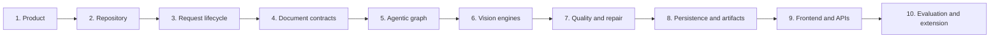

# Paperplane Zero to Mastery

A code-grounded tutorial for applied AI engineers

## How to use this tutorial

This guide teaches Paperplane by following one scanned PDF from the browser to the final
artifacts. It assumes you can read Python and TypeScript, use an HTTP API, and run Docker.
It does not assume familiarity with this repository, OCR layout models, LangGraph, or
document-grounding systems.

Each module has four parts:

1. **Goal** — what you should understand.
2. **Mental model** — the smallest useful explanation.
3. **Code trail** — files and symbols to inspect in order.
4. **Checkpoint** — a question or exercise that proves understanding.

Run the application before starting Module 3. Use the command-only
[run guide](RUN_APP.md), and keep [the architecture reference](ARCHITECTURE.md) open when
you need exact boundaries.

## Learning path



After the ten modules, complete the capstone trace and mastery checklist.

## Module 1 — Understand the product

### Goal

Explain why Paperplane is a document-intelligence pipeline rather than a thin OCR wrapper.

### Mental model

Plain OCR answers: “Which characters are on this page?” A useful document parser must also
answer:

- Which pixels form one semantic region?
- Is the region a heading, paragraph, table, formula, chart, footer, or figure?
- In what order should regions be read?
- Which heading owns this paragraph or table?
- Where did each answer come from?
- Did an independent check agree?

Paperplane preserves this structure in a canonical region graph and derives Markdown, JSON,
PDF overlays, chunks, and extraction values from the same graph.

### The three model roles

Do not treat every vision model as interchangeable:

| Role | Default implementation | Question answered |
|---|---|---|
| Document parsing | PaddleOCR-VL 1.6 | What regions exist, where are they, and in what order? |
| Targeted recognition | GLM-OCR or selected vision model | What exactly does this page or crop say? |
| Context review | Optional local or cloud reviewer | Does the assembled result agree with the page image? |

The separation matters. A reviewer cannot repair coordinates it never received, and a crop
recognizer should not be expected to reconstruct a whole document hierarchy.

### Code trail

1. Read `README.md` for the product contract.
2. Read `docs/how-it-works.md` for the end-to-end journey.
3. Open `backend/app/services/extraction/graph.py` and find `build_parser_graph`.

### Checkpoint

In two sentences, explain why replacing PaddleOCR-VL with a page-level chat prompt would
weaken auditability even if the prompt returned good Markdown.

## Module 2 — Map the repository

### Goal

Know where to look before changing behavior.

### Repository map

```text
backend/app/
  main.py                         FastAPI lifespan, routers, health
  config.py                       environment-backed runtime settings
  models/                         API schemas, enums, SQLAlchemy models
  routers/                        HTTP contracts
  services/extraction/graph.py    LangGraph nodes and conditional repair
  services/jobs.py                single-worker queue lifecycle
  services/parsing/               parsing, review, evidence, artifacts

backend/alembic/versions/         database migrations
backend/tests/unit/               backend public-contract tests
deploy/paddleocr-vl/worker.py     code mounted into the GPU container

frontend/src/app/page.tsx         main application workflow
frontend/src/components/          inspector, artifacts, schemas, quality
frontend/src/lib/api.ts           frontend API contracts and calls

docs/                             architecture, operation, and learning guides
scripts/                          release and document builders
```

### How to navigate a change

Start from the public boundary and follow ownership inward:

```text
UI action
  -> frontend API function
  -> FastAPI router
  -> queue or service
  -> graph/parser/storage contract
  -> database or artifact side effect
  -> response serializer
  -> UI rendering
```

For example, selective region reprocessing begins in `DocumentInspector`, calls
`requestReprocess` in `frontend/src/lib/api.ts`, enters `routers/reprocessing.py`, and is
executed by `services/parsing/reprocessing.py` through the existing queue/runtime.

### Checkpoint

Locate the code that validates `crop_padding`. Then identify the frontend union type that
prevents the UI from submitting unsupported values. Do not change either file.

## Module 3 — Trace one upload

### Goal

Follow a request from file bytes to a queued durable job.

### Step 1: browser submission

The main page collects files and one `ParseSettings` object. A single file uses the parse-job
endpoint; multiple files use the batch endpoint. The frontend talks to `/api`, and Next.js
rewrites that path to `PAPERPLANE_BACKEND_ORIGIN`.

### Step 2: API admission

`create_parse_job` in `backend/app/routers/parse_jobs.py` performs admission in this order:

1. parse and validate settings;
2. load and snapshot a selected extraction schema;
3. check PaddleOCR-VL runtime readiness;
4. validate selected local or cloud models;
5. enforce queue capacity;
6. read the upload with a size bound;
7. inspect its real type and page count;
8. persist source bytes and a job with pending page checkpoints;
9. commit before queue submission.

This ordering is a consistency feature. A rejected document does not leave a runnable job,
and a queued job already has durable metadata and source bytes.

### Step 3: queue ownership

The queue stores job IDs, not live request objects. The worker reloads the authoritative job
and invokes `run_parse_job`. Only one job runs at a time, which prevents concurrent GPU
containers and local models from exceeding workstation memory.

### Code trail

1. `frontend/src/app/page.tsx`
2. `frontend/src/lib/api.ts`
3. `backend/app/routers/parse_jobs.py:create_parse_job`
4. `backend/app/services/jobs.py:ParseJobQueue`
5. `backend/app/services/parsing/worker.py:run_parse_job`

### Exercise

Submit a one-page PDF, copy its job ID from the network response, and inspect:

```bash
curl http://localhost:8000/api/parse-jobs/JOB_ID
```

Find the persisted settings, page checkpoint, current batch, and artifact list. Explain
which fields can change while the job runs and which describe immutable source identity.

## Module 4 — Learn the document contracts

### Goal

Understand the canonical objects that keep Markdown, JSON, citations, and overlays aligned.

### Region

`Region` is the most important unit. It includes semantic type, content, normalized bounding
box, order, source, confidence, warnings, stable ID, hierarchy relationships, table cells,
and recognition candidates.

A stable ID such as `p0007-r0012` means “region 12 on source page 7.” That ID follows the
content into chunks, citations, schema grounding, diagnostics, and the inspector.

### PageLayout and DocumentLayout

`PageLayout` groups ordered regions for one page. `DocumentLayout` groups pages and
normalizes stable IDs. The layout is canonical; Markdown is a rendering of it, not the
database of record.

### RecognitionCandidate

A candidate records one attempt without erasing earlier evidence. It answers:

- which source and model produced the output;
- which attempt it was;
- whether it was selected;
- why it passed, warned, or failed;
- how confident and expensive it was.

### ContextChunk

A chunk is retrieval-oriented. In addition to text, it carries page, source page, box,
heading path, parent ID, order, type, confidence, and table metadata. This lets a RAG system
retrieve meaning and cite its location.

### Coordinate discipline

Parsing uses normalized coordinates so page-size and DPI differences do not change the
logical location. Image and PDF exporters convert at the boundary. Avoid storing arbitrary
pixel coordinates in canonical regions; doing so breaks re-rendering at another DPI.

### Code trail

1. `backend/app/services/parsing/contracts.py`
2. `backend/app/services/parsing/parser.py:build_document_layout`
3. `backend/app/services/parsing/parser.py:stitch_layout`
4. `backend/app/services/parsing/structured_blocks.py`

### Checkpoint

Trace one region ID into clean Markdown, grounded Markdown, a context chunk, and the page
inspection response. Which output intentionally omits machine-readable citation comments?

## Module 5 — Understand the LangGraph agent

### Goal

Explain what makes the workflow agentic and why it always terminates.

### Graph state

`ParserState` contains serializable paths, settings, regions, plans, review results, repair
issues, counters, warnings, and output fragments. Image bytes stay in the artifact store.
This keeps graph checkpoints durable and reasonably small.

### Graph nodes

```text
START
  -> ingest_and_render
  -> visual_segmentation
  -> agent_planning
  -> local_recognition
  -> layout_stitching
  -> cloud_context_review
       -> local_recognition  (repair required and budget remains)
       -> finalize           (otherwise)
  -> END
```

The agentic behavior is the observe-plan-act-verify loop:

- **Observe:** Paddle regions, native words, candidates, coordinates, warnings.
- **Plan:** resolve the quality policy and determine page actions.
- **Act:** run local recognition and assemble a layout.
- **Verify:** deterministic checks and optional visual review.
- **Revise:** target only failed regions.

`reflection_router` enforces the termination invariant. The loop is entered only when
`needs_repair` is true and the persisted count remains below finite `max_repairs`. Every
review-triggered traversal increments `repair_count` in `local_recognition` before the next
review, so no job can traverse the cycle more than `max_repairs` times. The initial scanned
recognition pass is outside this repair count.

### Why the graph is page-batched outside

The worker controls long-document batching and database commits; the graph controls the
processing decisions inside one batch. This separation means a graph failure cannot erase
earlier committed pages, and the graph state does not grow with an entire 500-page file.

### Exercise

Draw the state changes for this case:

1. Paddle returns a table with low confidence.
2. Local recognition produces a second candidate.
3. Cloud review rejects the result.
4. Blind local retry runs once.
5. The retry still fails and the repair budget is exhausted.

Your diagram must show the final warning rather than an infinite loop or silent success.

## Module 6 — Cross the vision-engine boundaries

### Goal

Understand why Docker, Ollama, and cloud providers are separate adapters.

### PaddleOCR-VL Docker runner

`PaddleOCRVLDockerRunner` validates Docker, the NVIDIA runtime, pinned image, writable model
cache, and worker script. It creates a manifest and runs a hardened ephemeral container.
The worker uses `PaddleOCRVL(pipeline_version="v1.6", use_layout_detection=True)` and writes
structured page results.

Only rendered inputs are read-only. Results and cache are distinct writable mounts. The
host validates progress lines and the final JSON before converting blocks into `Region`
objects.

### Ollama catalog and GLM adapter

`OllamaModelCatalog` discovers installed models and calls `/api/show` for capabilities.
Only models with both `vision` and `completion` can be selected. `glmocr_adapter.py` crops
the requested region, calls the selected model, and returns a candidate rather than
mutating unrelated regions.

### Cloud provider registry

`VisionProviderRegistry` is a server-side allowlist and adapter. It validates model choices,
loads keys from settings, shapes provider-specific requests, normalizes text/token/latency
results, and logs metadata without logging credentials or full document payloads.

The graph's `local_recognition` and `cloud_context_review` names describe pipeline roles,
not strict network boundaries. Recognition can use Ollama or a configured cloud provider;
review can use a distinct Ollama or cloud model. Processing mode controls escalation, while
the provider dropdown controls where the selected role executes.

### Failure isolation

- Missing Docker or GPU blocks new parse admission.
- Missing Ollama makes local models unavailable but does not make Paddle readiness false.
- A cloud request failure becomes a controlled provider error and warning when local output
  remains usable.
- Cancelling a job stops only a container with the matching job label.

### Checkpoint

Explain why the backend should not import PaddlePaddle directly even if that reduced one
subprocess boundary. Include dependency isolation, VRAM release, and cancellation safety.

## Module 7 — Reason about quality and repair

### Goal

Distinguish heuristic quality signals, independent review, and labeled evaluation.

### Three quality layers

1. **Deterministic validation** catches concrete structural failures: empty regions, broken
   tables, overlap, missing citations, bad coordinates, and incomplete coverage.
2. **Model review** compares the page image and assembled result, producing scores and
   region verdicts.
3. **Ground-truth evaluation** compares output against labeled documents and is the only
   layer that can support benchmark accuracy claims.

The UI's table integrity ratio is not table accuracy. If no labeled table exists, evaluated
accuracy remains `null`.

### Quality policies

`quality_policy.py` resolves thresholds from processing mode, detected document profile,
and allowed overrides. The resolved policy is snapshotted onto the job for auditability.

Within the initial graph, the newest recognition attempt becomes the selected region value
and earlier outputs remain candidates. Similarity below 0.6 adds disagreement evidence for
review; it is not a best-text voting algorithm. The stricter “apply only if equal or better”
comparison belongs to explicit page/region reprocessing, where the previous result is backed
up and can be restored.

### Blind local retry

If cloud review rejects a region, the agent can request another local crop. The crop prompt
does not contain the cloud answer. Independence matters because agreement between two
copies of the same answer is weak evidence.

### Automatic acceptance

Reprocessing does not expose manual candidate replacement. The service backs up the old
evidence, computes the new candidate, compares quality, and applies it only when the gate
passes. The decision and fingerprints remain durable.

### Exercise

Open a completed job, select a low-confidence region, and reprocess it at 300 DPI with 10%
padding. Inspect the run record and determine whether the output revision changed. Explain
why a completed reprocessing run may legitimately leave the accepted content unchanged.

## Module 8 — Master persistence and artifacts

### Goal

Know which store is authoritative for each kind of state and how recovery works.

### Application database

SQLAlchemy models include:

- `ParseJob`, `PageCheckpoint`, `Artifact`, and `ParseBatch`;
- `ReprocessRun` and `SubDocument`;
- `ExtractionSchema`;
- `EvaluationRun` and `EvaluationCase`;
- `ReviewCase`, `ReviewDecision`, `CuratedDocument`, and `CuratedExport`.

Alembic migrations evolve this schema. Startup runs migrations before accepting work.

### LangGraph checkpointer

The separate SQLite checkpointer records node-level graph progress. It is not a replacement
for application job state. If a browser asks whether page 12 is complete, the application
database and durable page artifact answer that question.

Page layout and diagnostic JSON are written before the database transaction marks a page
complete. A crash in between may leave an orphan file, but recovery ignores it because no
completed database checkpoint references it. Startup pauses stale active jobs, requeues jobs
that were already queued, and waits for explicit resume of paused work. Resume accepts only
a completed checkpoint whose referenced layout still validates.

### Artifact store

Artifacts are files plus database metadata: type, path, MIME type, size, and SHA-256. Types
include Markdown variants, context JSON, structured blocks, schema extraction, diagnostics,
annotated/searchable PDFs, figure crops, warnings, settings, manifests, and bundles.

### Recovery invariant

```text
page result is reusable
  iff database checkpoint says completed
  and referenced layout exists
  and stored layout validates
  and its fingerprint is acceptable
```

Partial jobs remain explicit. Missing pages are declared in Markdown/JSON, batch manifests
include failed members, and optional artifact failures become warnings.

### Checkpoint

For each item, name the authoritative store: original PDF bytes, job status, graph node
state, page layout JSON, artifact hash, and extraction-schema version.

## Module 9 — Connect the APIs and frontend

### Goal

Understand how the UI remains synchronized with durable backend evidence.

### API groups

| Group | Purpose |
|---|---|
| Parse jobs | create, list, inspect, stream, cancel, resume, retry, delete |
| Batches | multi-file admission, progress, combined ZIP |
| Inspection | source preview, page image, region evidence, tree, quality report |
| Reprocessing | page/region request and durable run status |
| Schemas | validate and version extraction schemas |
| Evaluation | create, monitor, cancel, and download benchmark reports |
| Review/curation | inspect failure cases and export curated evidence |
| Capabilities | local models, cloud readiness, and parser runtime status |

FastAPI's live OpenAPI view at `/docs` is the endpoint-level reference. The Markdown docs
explain behavior and invariants rather than duplicating every response field.

### Inspector synchronization

`DocumentInspector` holds a selected page and region. Searching or selecting a tree node
updates the page rail and overlay. Changing `output_revision` refetches the tree, quality
report, and page inspection after accepted reprocessing.

The three right-side views answer different questions:

- **Evidence:** which engine/model produced this content, and what alternatives existed?
- **Markdown:** how will this region or document be represented to downstream consumers?
- **Quality:** is coverage complete, where do candidates disagree, and is export verified?

### Exercise

Use browser developer tools to follow a region click. Identify which data was already in
memory and which request occurs only when the page or output revision changes.

## Module 10 — Evaluate, debug, and extend safely

### Goal

Make a small change without breaking grounding or recovery.

### Debugging loop

1. Reproduce with one small document and capture the job ID.
2. Inspect the job, page checkpoint, page diagnostics, and retained candidates.
3. Decide whether the failure is admission, rendering, layout, recognition, stitching,
   review, persistence, or artifact generation.
4. Change one boundary.
5. Add a public-contract regression test.
6. Run the narrow test, then the relevant backend or frontend suite.

Do not start by increasing timeouts or repair counts. Those changes often hide the stage
that failed.

### Safe extension patterns

#### Add a provider

Extend the registry allowlist and adapter, settings, capability response, UI selection, and
provider-contract tests. Keep credentials server-side and log provider/model/tokens/latency,
never authorization headers.

#### Add an artifact

Generate it from canonical layout or structured blocks, register it through the artifact
service, include a stable MIME type and hash, decide preview policy, and test bundle
inclusion.

#### Add a graph decision

Define typed state input/output, keep the node idempotent, persist any counter, set a hard
bound for new cycles, and test both branches plus exhausted-budget behavior.

#### Add an extraction field

Prefer a user schema or domain-profile rule grounded in canonical IDs. Do not scrape the
rendered Markdown if structured block evidence already exists.

### Verification commands

```bash
uv run --no-sync pytest backend/tests/unit -q
uv run --no-sync ruff check backend/app backend/tests scripts
uv run --no-sync ruff format --check backend/app backend/tests scripts
uv run --no-sync pyright

cd frontend
npx tsc --noEmit
npm run lint
npm test -- --run
npm run build
```

### Checkpoint

Choose one extension above and write its smallest coherent change list. Include the public
contract, failure behavior, test, and migration question. If the plan requires a new
abstraction used once, simplify it.

## Capstone — Trace a difficult scanned invoice

Use a multi-page scanned invoice containing a dense table and a repeated invoice number.
Perform this trace without editing code:

1. Start in `local_only` mode and enable segmentation and bundles.
2. Record the parse job ID and page status transitions.
3. Find the Paddle region containing the invoice number and its normalized box.
4. Compare Paddle and GLM candidates for one difficult line.
5. Locate the same region in grounded Markdown and structured blocks.
6. Find the corresponding schema-extraction citation.
7. Inspect the repeated identifier in the sub-document manifest.
8. Reprocess one region at a different DPI and inspect the acceptance decision.
9. Export the bundle and verify that settings, warnings, hashes, and source are represented.
10. If labels are available, run evaluation and separate benchmark metrics from runtime
    quality heuristics.

A successful capstone explanation should be able to answer: “Which pixels support this
value, which engines observed them, which candidate was accepted, why was it accepted, and
can the decision be reproduced?”

## Mastery checklist

You have mastered the codebase when you can:

- explain why layout, recognition, and review are separate stages;
- trace an upload through API admission, queueing, graph execution, and artifact assembly;
- identify the canonical region and coordinate contracts;
- draw the graph and prove its repair loop terminates;
- explain which state belongs in application SQLite, LangGraph SQLite, or file storage;
- distinguish deterministic quality, model review, and labeled evaluation;
- explain blind local retry without leaking the cloud answer;
- diagnose a failed page without rerunning the entire document;
- follow a region ID into Markdown, JSON, overlay, and schema citation;
- propose a minimal provider, artifact, graph, or extraction change with tests.

## Glossary

| Term | Meaning in Paperplane |
|---|---|
| Canonical layout | Ordered pages and regions from which all output forms are derived |
| Grounding | A link from output content to page, region, and coordinates |
| Recognition candidate | One retained engine/model attempt for a region |
| Visual review | Independent comparison of page pixels and assembled output |
| Blind retry | A local retry triggered by disagreement without revealing the cloud answer |
| Quality policy | Snapshotted thresholds and repair budget for a job |
| Page checkpoint | Durable database record and layout boundary for recovery |
| Graph checkpoint | LangGraph node-state snapshot used to resume execution |
| Sub-document | Classified contiguous page range within a mixed source file |
| Verified export | Output whose coverage and unresolved-region gates pass and whose required annotated PDF was created |

## Continue learning

- [How Paperplane works](how-it-works.md)
- [Architecture](ARCHITECTURE.md)
- [Quality](QUALITY.md)
- [Development](DEVELOPMENT.md)
- [Runbook](RUNBOOK.md)
- Live API reference at <http://localhost:8000/docs>
