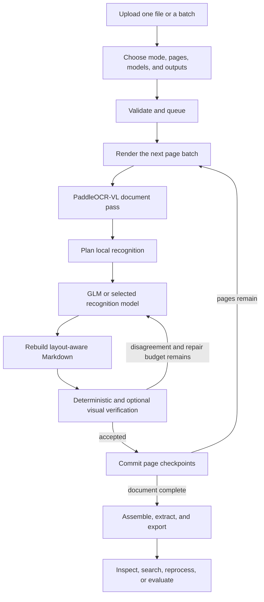

# How Paperplane works


> **V2 status (2026-08-14):** The active runtime is OpenAI-only and uses versioned recipes, bounded Terra verification, safe partial results, and private evidence bundles. This page retains older detail where useful; [README](../README.md) and [V2 architecture](ARCHITECTURE_V2.md) are authoritative for current behavior.

Paperplane turns the visual structure of a document into Markdown and structured evidence
that an LLM can use without repeatedly reopening the original PDF. It keeps the page,
coordinates, reading order, recognition source, and quality state attached to each block so
that every output remains inspectable.

This guide explains the processing journey. For code-level boundaries and persistence
contracts, see [Architecture](ARCHITECTURE.md).

## The journey at a glance



## 1. Upload and choose a strategy

You can drop one or several PDFs or document images into the UI. A single file creates a
parse job. Multiple files create a batch whose members share settings and whose completed
bundles can be downloaded together.

The most important choices are:

- **Input mode:** `scanned`, `native`, or `mixed`.
- **Processing mode:** `local_only`, `hybrid`, or `maximum_accuracy`.
- **Page range and DPI:** process only the pages you need at 150, 200, or 300 DPI.
- **Recognition model:** an installed Ollama vision model or configured cloud model for
  page/crop transcription.
- **Review model:** a separate optional Ollama or cloud model for page-level verification.
- **Outputs:** searchable PDF, figure descriptions, bundle, segmentation, and structured
  extraction options.

The UI shows only models the backend reports as configured and compatible. Cloud keys
remain in backend environment variables.

## 2. Validate before work starts

The backend validates the file signature, size, page count, page range, settings, schema,
provider, and model selection before queueing the job. It also verifies that Docker, the
pinned PaddleOCR-VL image, GPU runtime, cache directory, and worker script are available.

Only after validation succeeds does Paperplane store the source, create page checkpoints,
commit the job, and enqueue it. This prevents invalid uploads from leaving half-created
jobs.

## 3. Work in recoverable page batches

Paperplane processes at most 10 consecutive pages in one GPU batch by default. This keeps
peak memory bounded and creates frequent recovery points for long files.

For each batch, the host renders page images with PyMuPDF. If the source PDF has healthy
native words, it also captures their text and coordinates. Native text is useful evidence,
but it does not replace visual layout analysis in mixed documents.

Completed page checkpoints are committed before the next batch starts. A restart, resume,
or failed-page retry skips checkpoints whose fingerprints remain valid.

## 4. Let PaddleOCR-VL understand the page

The backend starts an ephemeral GPU container using the pinned official PaddleOCR-VL 1.6
image. The container receives read-only rendered pages and a manifest, then emits validated
progress events and structured results.

PaddleOCR-VL is responsible for the first complete document interpretation:

- region labels and bounding boxes;
- block reading order;
- OCR candidates;
- headings, paragraphs, lists, and marginalia;
- tables and table structure;
- formulas, figures, charts, and seals;
- Markdown-like structured content.

The container exits after the batch. Its model cache persists, but its GPU memory does not.
This separation prevents the layout service and later local models from competing for VRAM.

## 5. Use GLM-OCR as a distinct recognition stage

PaddleOCR-VL and GLM-OCR do not perform the same job in Paperplane. Paddle supplies the
document structure. GLM-OCR, or another selected vision model, receives pages or crops for
focused recognition.

Scanned pages can receive a primary local recognition pass even when Paddle returned usable
content. Later passes target only regions with evidence such as:

- empty or low-confidence text;
- malformed tables;
- candidate disagreement;
- coordinate or visual verification warnings;
- an independent reviewer failure.

Every attempt is retained as a recognition candidate. The inspection UI shows its source,
model, output, verdict, reason, and whether the agent selected it.

## 6. Reconstruct document meaning

Paperplane orders regions using Paddle's block order when available. It then adds lightweight
layout relationships without replacing that order:

- full-width versus column regions;
- heading levels and parent relationships;
- figure, chart, table, and caption links;
- repeated header, footer, and page-number handling;
- stable page-region IDs;
- table cells and their coordinates.

From this canonical layout, one pass produces clean Markdown, grounded Markdown, LLM
Markdown, structured blocks, and context chunks. Because all representations originate from
the same region graph, the Markdown and JSON do not silently drift apart.

## 7. Verify visually and decide what to repair

Verification combines deterministic checks with an optional vision reviewer.

Deterministic checks look for missing content, broken tables, low confidence, excessive box
overlap, invalid crops, missing citations, OCR disagreement, and incomplete coverage. The
system also draws region overlays and verifies that coordinates map to real visual areas.

If review is enabled, the model sees the page overlay, the assembled Markdown, region IDs,
coordinates, and recent candidate context. It scores extraction accuracy, structural
fidelity, completeness, and Markdown consistency, and returns region-level pass, warning,
or failure verdicts.

The selected processing mode controls escalation:

| Mode | Pages sent to a cloud reviewer | Blind local retry |
|---|---|---|
| Local only | None | Not cloud-triggered |
| Hybrid | Locally flagged pages | Available on cloud disagreement |
| Maximum accuracy | Every selected page | Enabled when configured |

Provider selection and processing mode are separate controls. Choosing a remote recognition
provider can send targeted page crops to that provider even when context review is off.
`local_only` configures local providers for both roles; hybrid and maximum-accuracy presets
enable remote review according to their policies.

When the reviewer disagrees, Paperplane can run a second local crop. GLM sees the original
image region and the task, but not the cloud answer. This preserves an independent local
observation. The loop stops when the page passes or the configured repair budget is spent.
Unresolved issues remain visible as warnings; they are not silently discarded.

## 8. Commit pages and assemble the whole document

After a page finishes, Paperplane stores its canonical layout, diagnostics, model metadata,
quality state, and fingerprint. When all possible pages finish, the document assembler:

1. rebuilds heading hierarchy and reading order across batch boundaries;
2. applies the marginalia policy consistently across the document;
3. declares any missing or failed pages in partial outputs;
4. classifies and splits mixed multi-document files when requested;
5. runs domain or user-defined schema extraction;
6. creates artifacts and a reproducibility manifest.

Mixed-file segmentation uses page transitions, document type, and repeated identifiers such
as invoice numbers, dates, or order IDs. It reuses existing page evidence instead of paying
for OCR again.

## 9. Export evidence, not just text

Typical outputs include:

| Output | Intended use |
|---|---|
| Clean Markdown | Human reading and ordinary LLM prompts |
| LLM/grounded Markdown | Prompts that require page, region, and box citations |
| Structured blocks | Deterministic downstream processing of text, tables, figures, forms, and cells |
| Context chunks | RAG ingestion with hierarchy, source page, coordinates, and confidence |
| Schema extraction | Flat or nested application data with value-level grounding |
| Annotated PDF | Visual audit of region types, IDs, order, source, and confidence |
| Searchable PDF | Original appearance with an invisible text layer |
| Diagnostics and quality report | Coverage, disagreement, unresolved regions, integrity, and warnings |
| Bundle ZIP | Source plus selected outputs, settings, hashes, and manifest |

Schema extraction is evidence-first. Deterministic matches run before model completion, and
model-produced values are accepted only when they cite canonical region or table-cell IDs.
Large tables can be exported as JSONL rows with cell-level grounding.

## 10. Inspect and selectively reprocess

The completed-job workspace has three synchronized views:

- a searchable hierarchy and page rail;
- the source page with clickable region boxes and reading-order labels;
- evidence, Markdown, and quality panels.

Selecting a tree item moves the page and overlay to the same block. Candidate cards are
read-only: they explain the automatic decision rather than allowing an unaudited manual
replacement.

You can request page or region reprocessing with a different DPI and crop padding. The
previous layout and diagnostics are backed up first. The new output receives an automatic
quality decision and is applied when it meets or improves the stored score without reducing
the stored quality-status rank.

## 11. Evaluate and improve the system

Evaluation mode compares completed jobs with grounded labeled documents. It measures
Markdown similarity, regions, text, hierarchy, reading order, citations, boxes, and tables.
These are benchmark metrics; the normal quality panel does not claim labeled accuracy when
no ground truth exists.

Review cases and curation records capture unresolved or disputed evidence. This creates a
repeatable improvement loop:

```text
failure -> durable evidence -> review/label -> evaluation -> policy or model change
        -> regression test -> measured improvement
```

## Why this is agentic

Paperplane is agentic because it observes page evidence, creates a page-specific plan,
selects tools, evaluates the result, and conditionally revises only the failed regions. The
decisions and repair count live in durable graph state.

It is not agentic merely because it calls an LLM. The important properties are:

- explicit state and goals;
- specialized tools with distinct responsibilities;
- conditional routing based on evidence;
- independent verification;
- bounded iteration;
- durable decisions and provenance;
- a deterministic termination path.

## Relationship to ADE and LlamaParse

Paperplane uses publicly described design patterns associated with LandingAI ADE: treat the
page as an image, segment it into grounded regions, reason over crops, and keep spatial
citations. It also targets useful LlamaParse output properties: reconstructed hierarchy,
reading order, tables, LLM-ready Markdown, and retrieval-friendly chunks.

These are architectural inspirations, not service integrations. Accuracy depends on the
document distribution, configuration, models, and labeled evaluation set. A published
result from another product does not transfer automatically to Paperplane.

## Practical limits

Paperplane runs one document job at a time and defaults to 500 pages and 200 MB per file.
It is suitable for a GPU workstation and long local documents, not a distributed enterprise
ingestion fleet. It has no built-in user accounts or tenant isolation. Use API-key
protection, restricted CORS, TLS, and an external identity boundary before network exposure.
